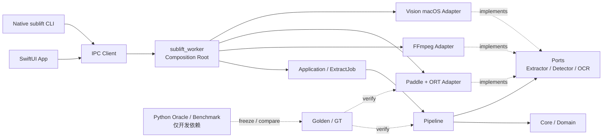

# Phase 6.9 — Native C++ 产品目标架构

> 状态：**100% 交付完成（feat-06901–06913 全部落地）**  
> 实施计划：[phase6.9-implementation-plan.md](phase6.9-implementation-plan.md) (全部 DONE)  
> 前置完成：Phase 6.8 Paddle Native hardening / product cutover  
> 当前基线：vision/mock/paddle 全引擎 → Native C++；SubLift.app 标准打包；Python 保留为 Oracle / benchmark / 显式回滚  
> 关联契约：
> [Phase 6 总览](phase6-overview.md) ·
> [C++ Core 架构](architecture.md) ·
> [Worker IPC](worker-ipc-contract.md) ·
> [引擎矩阵与回滚](engine-matrix-and-cutover.md) ·
> [Phase 6.8](phase6.8-paddle-hardening.md)

## 1. 结论

SubLift 的理想 C++ 架构不是把所有 Python 文件逐一翻译成 C++，也不是把
SwiftUI、Worker 和 OCR 强行合并成一个进程，而是：

> **产品运行与分发完全 Native C++；SwiftUI 和 Native CLI 是薄客户端；平台能力以
> Adapter 接入；Python 只保留为开发期 Oracle、benchmark、fixture 与质量门工具。**

目标态继续保留已经验证稳定的 **Swift/CLI → IPC → C++ Worker** 进程边界：

- GUI 与 CLI 使用同一个 C++ Worker 产品执行路径；
- Worker 是产品 Composition Root，负责选择并装配能力模块；
- Core / Pipeline 不知道 Swift、JSON、UDS、FFmpeg 进程、ORT 或 Apple Vision；
- Paddle、Vision、FFmpeg 都是实现稳定 Port 的可替换 Adapter；
- Python 不进入正式安装包，也不参与正常产品进程；
- 冻结 golden、GT 和验收阈值继续保护 C++ 演进。

Phase 6.9 不得以去 Python 或打包为理由降低 Phase 6.8 已冻结的 Paddle 质量、
性能、长流、取消或重启门。

## 2. 为什么仓库根目录保留 `cpp/`

### 2.1 纯 C++ 仓库与多语言仓库

纯 C++ 仓库通常直接把 C++ 工程放在仓库根目录：

```text
project/
├── CMakeLists.txt
├── include/
├── src/
├── tests/
└── cmake/
```

SubLift 是多语言产品仓库，同时包含 Swift、C++、Python、benchmark 和文档，因此
在根目录使用独立的 `cpp/` 是合理且常见的布局：

```text
SubLift/
├── cpp/                    # 唯一 C++ 工程根
├── apps/macos/             # SwiftUI 客户端
├── src/sublift/            # 当前 Python Runtime / Oracle
├── scripts/                # benchmark / parity / 工程脚本
├── benchmark/
└── docs/
```

结论：

- 保留根目录现有的 `cpp/`；
- `cpp/CMakeLists.txt` 继续作为 C++ 工程入口；
- 不创建 `cpp/cpp/`；
- 不为了看起来像纯 C++ 项目而把 CMake、headers 和 sources 提升到仓库根目录；
- 只有未来整个仓库不再包含 Swift/Python 等其他工程时，才有理由重新评估是否提升。

### 2.2 目录整理原则

目录结构是依赖关系的可视化，不是架构本身。实施顺序必须是：

1. 先建立正确的 CMake target 和链接方向；
2. 运行 target 级测试确认边界；
3. 再机械移动物理文件；
4. 每次只迁移一个可独立验收的模块；
5. 禁止一次性大规模重命名、移动和重构实现。

## 3. 当前基线与目标差距

### 3.1 已经正确的基础

当前实现已经具备目标架构的大部分关键接缝：

- `sublift_core`：模型、Config、图像、打轴与 Pipeline 算法；
- `sublift_ffmpeg`：ffmpeg/ffprobe subprocess 抽帧；
- `sublift_paddle`：ORT + PP-OCRv6 Det/Cls/Rec；
- `sublift_vision_macos`：Objective-C++ Apple Vision Adapter；
- `sublift_worker`：UDS Worker；
- `sublift_cli`：Native CLI；
- `sublift_test_support`：golden 与 parity 测试支持；
- Swift `PipelineClient`：Worker 进程管理和 IPC；
- Python：冻结 Oracle、benchmark、fallback 与回滚。

### 3.2 尚未收口的结构

| 差距 | 当前表现 | 目标 |
|---|---|---|
| IPC 与应用编排耦合 | `sublift_ipc` 同时含 protocol、Bridge 和产品依赖装配 | 拆为 protocol / application / worker |
| CLI 双路径 | 原生 CLI 已存在，但 `uv run sublift` 仍是主要开发入口之一 | 正式产品只发布 Native CLI |
| Python fallback | C++ Paddle 不可用时启动 Python Worker | 分发稳定后改为明确的 Native capability 错误 |
| 模型交付 | C++ 读取 rapidocr 共用缓存，首次准备依赖 Python 命令 | Native `ModelBundle/ModelManager` |
| Paddle 可见面过大 | 公共 Paddle header 暴露 trace/options 等内部细节 | 产品接口与 diagnostics 分离 |
| 分发 | build tree 已有 ORT 相对 rpath，但未形成正式 `.app` | 模型/ORT/ffmpeg 随包、签名、公证 |
| Python 代码位置 | 产品 Runtime、Oracle、benchmark 同处现有 Python 工程 | fallback 到期后收敛为 dev-only tools |
| 跨平台 transport | 当前 UDS 面向 macOS/POSIX | transport 抽象，Windows Named Pipe 可替换 |

## 4. 目标进程架构



### 4.1 为什么继续保留 Worker 进程边界

- 隔离 ORT、OpenCV、Apple Vision 和 ffmpeg 的崩溃/资源生命周期；
- GUI 与 CLI 共用同一产品数据流；
- 保留现有取消、断连回收和 restart 契约；
- 未来 Linux/Windows 只需替换 transport 与平台 Adapter；
- 避免 Swift C++ interop 把 C++ ABI、第三方 dylib 和对象生命周期暴露给 UI；
- 可独立 probe capability、模型与动态库完整性。

Phase 6.9 默认不推进 Swift↔C++ 单进程直连。只有 Worker IPC 被证明成为真实瓶颈时，
才可另立 feature 评估。

## 5. 目标 CMake Target 与依赖方向

### 5.1 Target 划分

| Target | 职责 | 允许依赖 |
|---|---|---|
| `sublift_core` | models、Config、错误码、图像/几何、纯算法 | C++20 STL；必要的私有图像实现 |
| `sublift_pipeline` | signature、changepoint、timeline、dedupe、line select、流式 Pipeline | `sublift_core`、Ports |
| `sublift_protocol` | IPC DTO、framing、JSON 编解码、协议版本 | core models；nlohmann/json 私有 |
| `sublift_application` | `ExtractJob`、进度、取消、job 生命周期 | pipeline、Ports |
| `sublift_ffmpeg` | probe、抽帧、子进程控制 | core / extractor Port、POSIX/平台进程 API |
| `sublift_paddle` | PP-OCRv6 Det/Cls/Rec Adapter | core / OCR Port；ORT/OpenCV 私有 |
| `sublift_vision_macos` | Apple Vision Adapter | core / OCR Port；Apple Framework 私有 |
| `sublift_worker` | Composition Root；装配 application、protocol 和 adapters | 上述产品 targets |
| `sublift_cli` | 参数解析、Worker launch、IPC client、SRT 输出 | protocol / launcher；不实现 OCR |
| `sublift_test_support` | golden loader、fixture、比较器 | 仅测试使用 |
| `sublift_paddle_trace` | tensor/stage/perf 诊断 | Paddle + test support；不进入产品包 |

### 5.2 依赖方向

```text
sublift_cli ───────────────► sublift_protocol
                                  │
                                  ▼
sublift_worker ────────────► sublift_application ─► sublift_pipeline ─► sublift_core
       │                              ▲                    ▲
       ├─► sublift_ffmpeg ────────────┤                    │
       ├─► sublift_paddle ────────────┤                    │
       └─► sublift_vision_macos ──────┘                    │
                                                          │
sublift_test_support / diagnostics ────────────────────────┘
```

硬约束：

1. `core` 不依赖 protocol、worker、JSON、UDS、ORT、Vision、Swift 或 ffmpeg 进程；
2. `pipeline` 只依赖抽象 Port，不实例化具体 OCR/Extractor；
3. Adapter 不依赖 worker 或 protocol；
4. protocol 不依赖 OCR、FFmpeg 或平台 Framework；
5. Worker 是唯一产品 Composition Root；
6. CLI 不复制 Pipeline/OCR，实现上只做产品参数和 IPC；
7. 产品 targets 不得依赖 `test_support` 或 diagnostics；
8. ORT/OpenCV/Apple Framework 均保持 Adapter 的 `PRIVATE` 依赖；
9. public headers 不暴露 `cv::Mat`、Ort 类型、Objective-C 类型或 nlohmann/json 类型。

## 6. 目标物理目录

```text
cpp/
├── CMakeLists.txt
├── README.md
├── cmake/
│   ├── Dependencies.cmake
│   ├── FindONNXRuntime.cmake
│   └── presets/
│
├── include/sublift/
│   ├── core/                   # 公共 models、config、errors、image
│   ├── ports/                  # IOcrEngine、IExtractor、IDetector
│   ├── pipeline/               # Pipeline 公共接口
│   └── protocol/               # 稳定 IPC DTO / version
│
├── src/
│   ├── core/
│   ├── pipeline/
│   ├── application/
│   ├── protocol/
│   ├── adapters/
│   │   ├── ffmpeg/
│   │   ├── paddle/
│   │   │   ├── engine.cpp
│   │   │   ├── model_bundle.cpp
│   │   │   ├── ort_session.cpp
│   │   │   ├── det/
│   │   │   ├── cls/
│   │   │   └── rec/
│   │   └── vision_macos/
│   ├── worker/
│   └── cli/
│
├── diagnostics/
│   └── paddle_trace/
│
├── tests/
│   ├── unit/
│   ├── contract/
│   ├── integration/
│   └── parity/
│
└── packaging/
    ├── macos/
    ├── linux/
    └── windows/
```

### 6.1 现有目录到目标目录的映射

| 当前 | 目标 |
|---|---|
| `cpp/src/core/` | 保留纯算法；把应用编排拆到 `pipeline/` / `application/` |
| `cpp/src/ffmpeg/` | `cpp/src/adapters/ffmpeg/` |
| `cpp/src/paddle/` | `cpp/src/adapters/paddle/` |
| `cpp/src/vision_macos/` | `cpp/src/adapters/vision_macos/` |
| `cpp/src/worker/framing.*`、`protocol.*` | `cpp/src/protocol/` |
| `cpp/src/worker/bridge.*` | `cpp/src/application/` 与薄 Worker handler |
| `cpp/src/worker/main.cpp` | 保留为 Composition Root |
| `cpp/src/paddle/paddle_trace_main.cpp` | `cpp/diagnostics/paddle_trace/` |
| `cpp/src/test_support/` | 保留；禁止产品依赖 |

物理移动不得与行为修改混在同一提交。若移动后需要修复 include/CMake，只允许机械修复。

## 7. Core、Ports 与 Application

### 7.1 Core / Domain

Core 是跨平台且可确定的产品语义层，包含：

- `Config` 与完整默认值；
- `Frame`、`ImageBuffer/ImageView`、坐标类型；
- `Region`、`OcrLine/OcrResult`、`SubtitleEntry`；
- timeline、dedupe、line select 等**不依赖 OpenCV 编排**的纯领域算法与模型；
- 稳定错误码和结果模型。

流式 Pipeline 编排以及 signature / changepoint（可依赖图像实现）归属
**`sublift_pipeline`**（见 §5.1），不继续堆在 `sublift_core` 上。

Core 不负责：

- 解析 IPC JSON；
- 创建 ffmpeg/ORT/Vision；
- 查找安装路径；
- 下载模型；
- 输出用户日志；
- 选择产品引擎；
- 处理 Swift/CLI 参数；
- 实例化具体 Extractor / OCR Adapter。

### 7.2 Ports

产品能力通过稳定接口表达：

```cpp
class IFrameExtractor;
class IRegionDetector;
class IOcrEngine;
class IProgressSink;
class ICancellationToken;
class IModelStore;
```

接口只使用 SubLift 自有数据模型，避免第三方类型泄漏。

### 7.3 Application

Application 层实现产品 use case：

- `ExtractJob`；
- Worker job 状态机；
- path mode / frame mode；
- progress 与增量 entry；
- cancel/finalize/restart；
- capability 和业务错误映射；
- 每 job 的资源所有权。

Application 不直接构造具体 Adapter。具体对象由 Worker Composition Root 注入。

## 8. Worker 生命周期与所有权

```text
Worker lifetime
├── RuntimeCapabilities
├── ResourceLocator
├── ModelBundle
├── Paddle / Vision session        # 长生命周期，可跨 job 复用
└── Connection
    └── JobContext                 # 每个 job 独立
        ├── FfmpegExtractor
        ├── Pipeline
        ├── CancellationToken
        ├── ProgressSink
        ├── bounded frame buffers
        └── per-job scratch/result
```

约束：

- ORT session、模型 metadata 和 `MemoryInfo` 不按帧创建；
- 每个 Job 的 ffmpeg、Pipeline、取消状态和结果完全隔离；
- cancel 通过 RAII / scope cleanup 终止并 `wait` ffmpeg；
- job 完成或取消后不允许迟到消息污染下一 job；
- 帧与 OCR scratch 保持有界复用，不累计整段视频；
- 同一 Pipeline 默认串行消费，OCR 默认串行；
- 只有通过既有质量、wall、RSS、cancel/restart 门后，才允许引入有界并发；
- 不使用进程级可变全局状态保存 job 数据。

## 9. Paddle Adapter 目标状态

当前 Paddle 算子质量与性能已达到 cutover 门；Phase 6.9 的目标是缩小职责和公开面，
不是重写已经验收的数值实现。

### 9.1 模块划分

| 模块 | 职责 |
|---|---|
| `PaddleOcrEngine` | 组合 Det → crop → Cls → Rec → line mapping |
| `ModelBundle` | det/cls/rec/dict 路径、tier、SHA、metadata |
| `OrtSession` | provider、thread、session、tensor name、MemoryInfo |
| `DetOperator` | resize/normalize、ORT、DB/dilation/unclip/sort |
| `CropOperator` | perspective crop、方向保持、坐标映射 |
| `ClsOperator` | batch、48×192 preprocess、180° 旋转 |
| `RecOperator` | 动态宽度、batch/padding、CTC decode |
| `PaddleDiagnostics` | stage tensor、耗时、batch/call 统计 |

### 9.2 公共接口

产品公共 header 最终只暴露稳定接口：

```cpp
struct PaddleOptions;
struct PaddleCapabilities;
class PaddleOcrEngine final : public IOcrEngine;
```

下列内容应转为 internal 或 diagnostics：

- tensor trace 结构；
- golden dump 类型；
- Det quad override；
- 测试注入字段；
- ORT session/input/output names；
- OpenCV/Clipper 内部类型。

### 9.3 数值与性能约束

- 模型、ORT、provider、线程数、batch 和字典 SHA 必须进入 manifest；
- availability probe 与实际 constructor 使用同一个 `ModelBundle` 解析器；
- 不允许 probe 成功但真实启动查找另一套模型/ORT；
- 不以 batch/thread 微优化换取 SRT 或 stage 输出漂移；
- diagnostics 默认关闭，关闭时不得显著改变热路径；
- Det/Cls/Rec 纯算子继续保留独立 unit/stage tests。

## 10. 模型与资源管理

去 Python 产品依赖前，必须提供 Native `ResourceLocator + ModelManager`。

### 10.1 查找顺序

建议顺序：

1. 显式开发者 override；
2. `.app` / 安装目录内已签名资源；
3. 用户缓存中的已验证版本；
4. 若产品允许在线安装，则进入明确的下载流程；
5. 均不可用时返回可操作错误，不静默切换 OCR 引擎。

### 10.2 Model manifest

每个 bundle 至少记录：

- schema version；
- model tier / language capability；
- det/cls/rec/dict 文件名与 SHA256；
- 兼容 ORT version/ABI/provider；
- 默认 thread/batch；
- 模型来源和许可证；
- 最低产品版本；
- 可选下载 URL 与包 SHA。

下载必须使用临时文件、完整 SHA 校验和原子 rename；失败不得留下可被 probe
误判为完整模型的半成品。

## 11. IPC、Config 与能力声明

### 11.1 Protocol

`sublift_protocol` 只负责：

- 4-byte big-endian framing；
- JSON DTO 与 schema/version；
- hello/capabilities；
- progress/push_entry/entries/error；
- 稳定错误码。

业务对象与 DTO 通过显式 mapper 转换，Core 不直接读写 JSON。

### 11.2 Capability

Worker capability 必须由真实 Composition Root 计算：

- 当前二进制是否包含 Adapter；
- 动态库是否可加载；
- 模型 bundle 是否完整且 SHA 正确；
- 平台 API 是否可用；
- 支持的 path/frame/cancel/push 能力。

禁止根据文件名或环境变量单独猜测 capability。

### 11.3 Config

- C++ `Config` 是产品运行时唯一 canonical config；
- Swift/CLI/IPC 只传显式 override；
- default 值由 C++ Core 定义并用 golden 锁定；
- Config schema 版本化；
- 未识别字段按协议规则处理，不能静默改变行为；
- Python Oracle 保留同字段映射用于 parity，但不再主导产品默认。

## 12. GUI 与 CLI

### 12.1 GUI

SwiftUI 负责：

- 文件选择与预览；
- 参数和字幕区域选择；
- Worker launch / IPC；
- 进度、取消、结果编辑与导出；
- 显示 runtime、engine、model、capability 和错误。

SwiftUI 不实现：

- 产品抽帧；
- OCR；
- 时间轴和去重；
- 模型下载细节；
- Python fallback 业务逻辑。

### 12.2 Native CLI

正式 CLI 与 GUI 使用同一个 Worker 路径：

```text
sublift CLI
  ├── parse/validate product arguments
  ├── locate and spawn sublift_worker
  ├── IPC ExtractJob
  └── export SRT / machine-readable result
```

不建议让 CLI 直接链接全部 adapters 后另走一套 in-process pipeline，否则会重新产生
CLI 与 GUI 行为、生命周期和日志差异。

## 13. 产品分发目标

macOS 目标布局：

```text
SubLift.app/
└── Contents/
    ├── MacOS/SubLift
    ├── Helpers/sublift_worker
    ├── Frameworks/
    │   ├── libonnxruntime.dylib
    │   └── OpenCV 动态依赖（若未静态链接）
    ├── Resources/
    │   ├── models/
    │   │   ├── manifest.json
    │   │   ├── det.onnx
    │   │   ├── cls.onnx
    │   │   ├── rec.onnx
    │   │   └── dict.txt
    │   └── bin/
    │       ├── ffmpeg
    │       └── ffprobe
    └── Resources/THIRD_PARTY_NOTICES.md
```

分发门：

- 无 Python、uv、`.venv`；
- 所有动态库使用 app-relative rpath；
- models/ORT/ffmpeg/OpenCV 来源与许可证归档；
- universal2 或明确的架构包；
- Developer ID codesign、notarization、staple；
- Gatekeeper 下在另一台干净 Mac 启动；
- 无用户模型缓存时仍能完成产品定义的首次运行；
- 断网情况下已随包资源可正常提取；
- `otool -L` / codesign 验证不指向 Homebrew、venv 或开发绝对路径。

## 14. Python 的最终位置

### 14.1 产品侧

理想产品安装包：

- 不包含 Python interpreter；
- 不包含 Python packages；
- 不需要 uv；
- 不读取 `.venv`；
- 正常路径和错误路径都不 spawn Python；
- C++ capability 不可用时给出明确产品错误或 Native 安装流程。

### 14.2 仓库开发侧

Python 仍有长期价值，建议最终收敛为：

```text
tools/python/
├── oracle/
├── benchmark/
├── fixture_generation/
└── parity_gates/
```

迁移原则：

- Python fallback 至少按既有决策保留一个小版本周期；
- fallback 退役前不移动或删除其运行模块；
- Python Oracle 冻结，不继续承载产品新功能；
- benchmark 可以继续用 Python 统计 F1/CER/RSS，不在 C++ 重写第二套指标；
- Python 依赖进入 dev/oracle extra，不进入产品 artifact；
- 是否物理移动 `src/sublift` 必须另立独立 feature，不能与产品打包混做。

## 15. 测试与质量架构

| 层级 | 目标 |
|---|---|
| Unit | core 纯函数、Det/Cls/Rec 算子、模型 manifest、protocol framing |
| Contract | Ports、Config/DTO mapper、capability、error code |
| Integration | Worker path/frame mode、真实 ffmpeg、真实 OCR adapter |
| IPC E2E | Native CLI/Swift → Worker，取消、断连、restart、迟到消息 |
| Parity | 冻结 golden、stage、跨 runtime SRT/quality |
| Product | 签名 `.app`、干净机器、无 Python、断网、长流 |
| Performance | canonical wall/RSS、首条、cancel/restart、720s 流 |
| Sanitizer | Core/Worker Debug ASan+UBSan；依赖隔离有明确报告 |

测试规则：

- 产品 feature 必须同时有 target-level test 和 product path test；
- 目录移动只跑原有门，不更新 golden；
- golden 更新必须独立、可解释、带 Oracle/环境指纹；
- Python Oracle 不可作为 C++ unit test 的在线隐式依赖；
- 发布 artifact 必须在 `PATH` 无 Python、无 Homebrew 优先路径的环境验收。

## 16. 可观测性与错误模型

### 16.1 结构化身份

Worker/CLI/GUI 至少公开：

- runtime；
- engine；
- model tier/version/hash；
- provider / ORT version；
- capability resolution source；
- stable/fallback/error 状态；
- job id / video id；
- processing wall 和关键计数。

产品日志不得硬编码“Python/C++ extractor”，必须来自最终 Worker identity。

### 16.2 Diagnostics

- tensor/stage dump 显式 opt-in；
- 性能 trace 显式 opt-in；
- 默认产品输出不携带大 tensor；
- diagnostics target 不进入正式安装包；
- 日志字段版本化，benchmark 解析 fail-closed。

### 16.3 错误边界

- Core：稳定错误码或受控异常，只表达领域错误；
- Adapter：把 ORT/OpenCV/Vision/ffmpeg 错误转为 SubLift error；
- Application：补充 job context，不静默换引擎；
- Protocol：序列化稳定 code + 用户可读 message；
- GUI/CLI：展示可操作建议，详细内部信息进入日志。

## 17. 跨平台约束

- `sublift_core/pipeline/application/protocol` 必须在 macOS/Linux/Windows 编译；
- Vision 只存在于 `vision_macos`；
- POSIX spawn/kill/UDS 封装在平台 Adapter；
- Windows transport 可实现 Named Pipe，但复用同一 DTO/state machine；
- `ResourceLocator` 处理 `.app`、Linux install prefix、Windows app directory；
- path、UTF-8、进程退出码和信号差异不得泄漏到 Core；
- CMake presets 至少覆盖 macOS product、Linux core+paddle、sanitizer；
- 平台差异通过 capability 明确表达，不用编译成功假装运行可用。

## 18. 实施顺序

正式实施顺序与验收以
[phase6.9-implementation-plan.md](phase6.9-implementation-plan.md) 与
`docs/phases/phase6.json` 的 **feat-06901–06913** 为准。摘要：

| 波浪 | Features | 主题 |
|---|---|---|
| A 结构 | 06901–06906 | protocol/application/pipeline/CLI 链接面、目录、Paddle 公共面 |
| B 资源 | 06907–06909 | ModelBundle、capability、Native CLI paddle |
| C 分发 | 06910–06912 | macOS bundle、签名公证、Python-free 门 |
| D 退役 | 06913 | fallback 退役与终态文档 |

Linux/Windows 完整分发与 Named Pipe 属 **6.10+**。  
若 Target 拆分造成标准门过重，按 `AGENTS.md` 把发布级门留在独立脚本/CI，不塞入默认 `./init.sh`。

## 19. Python-free 产品完成定义

只有同时满足以下条件，才能声明产品已去除 Python 依赖：

- [ ] GUI 与正式 CLI 都只启动 C++ Worker；
- [ ] 产品安装包不含 Python/uv/.venv；
- [ ] C++ Worker 可独立发现并验证模型、ORT、ffmpeg；
- [ ] 无模型时由 Native ModelManager 完成安装或给出明确错误；
- [ ] C++ unavailable 不再静默启动 Python；
- [ ] capability probe 与真实 job 使用同一资源解析器；
- [ ] 无 Python 的干净机器完成真实视频 → SRT；
- [ ] 6.8 stage / quality / performance 门不退化；
- [ ] cancel ≤1s、restart ≤5s、≥10min 长流通过；
- [ ] `.app` rpath、codesign、notarization、Gatekeeper 通过；
- [ ] 第三方依赖与模型许可证完整；
- [ ] Python Oracle/benchmark 与产品 artifact 完全解耦；
- [ ] 文档、phase evidence 和回滚/迁移说明已更新。

## 20. 非目标

- 不把所有 Python 代码机械翻译成 C++；
- 不在目录整理中修改 OCR、打轴或去重算法；
- 不为了“单进程”删除已经验证的 Worker IPC；
- 不在 C++ 内复制 Python benchmark 的整套统计实现；
- 不引入 Boost、Qt、重型 DI/async 框架；
- 不用无界 producer/consumer 队列换取表面吞吐；
- 不在 fallback 观察期结束前删除 Python 回滚；
- 不因打包困难放宽模型/ORT SHA、质量或性能门。

## 21. 待正式 feature 决策的问题

| 问题 | 当前建议 |
|---|---|
| 模型随包还是首次下载 | small 模型随包；下载只用于可选更新/其他 tier |
| CLI 直链 Core 还是走 Worker | 走 Worker，保证 GUI/CLI 单一产品路径 |
| OpenCV 静态还是动态 | 先做体积/许可/签名矩阵，再冻结；禁止依赖 Homebrew 绝对路径 |
| ffmpeg 随包策略 | 随包并归档许可证；保留开发期显式 override |
| Python Oracle 是否删除 | 不删除；改为 dev-only 并冻结 |
| Windows IPC | Named Pipe Adapter，复用 DTO 与 job state machine |
| diagnostics 是否进产品包 | 不进入；需要时单独开发 artifact |

## 22. 文档维护

- 本文描述 **6.8 cutover 后的 Native 产品目标态**；
- [architecture.md](architecture.md) 继续保留 6.0 迁移时冻结的 Core 数据/接口契约；
- [worker-ipc-contract.md](worker-ipc-contract.md) 继续作为时序与取消契约；
- [engine-matrix-and-cutover.md](engine-matrix-and-cutover.md) 继续记录双轨、回滚和 cutover 门；
- 正式 6.9 feature、状态和验证证据必须写入 `docs/phases/phase6.json`；
- 发生架构决策时写入 `docs/DECISIONS.md`，本文只同步最终结果；
- 目录或 target 变化后必须更新本文映射，但不得删除历史迁移文档。

