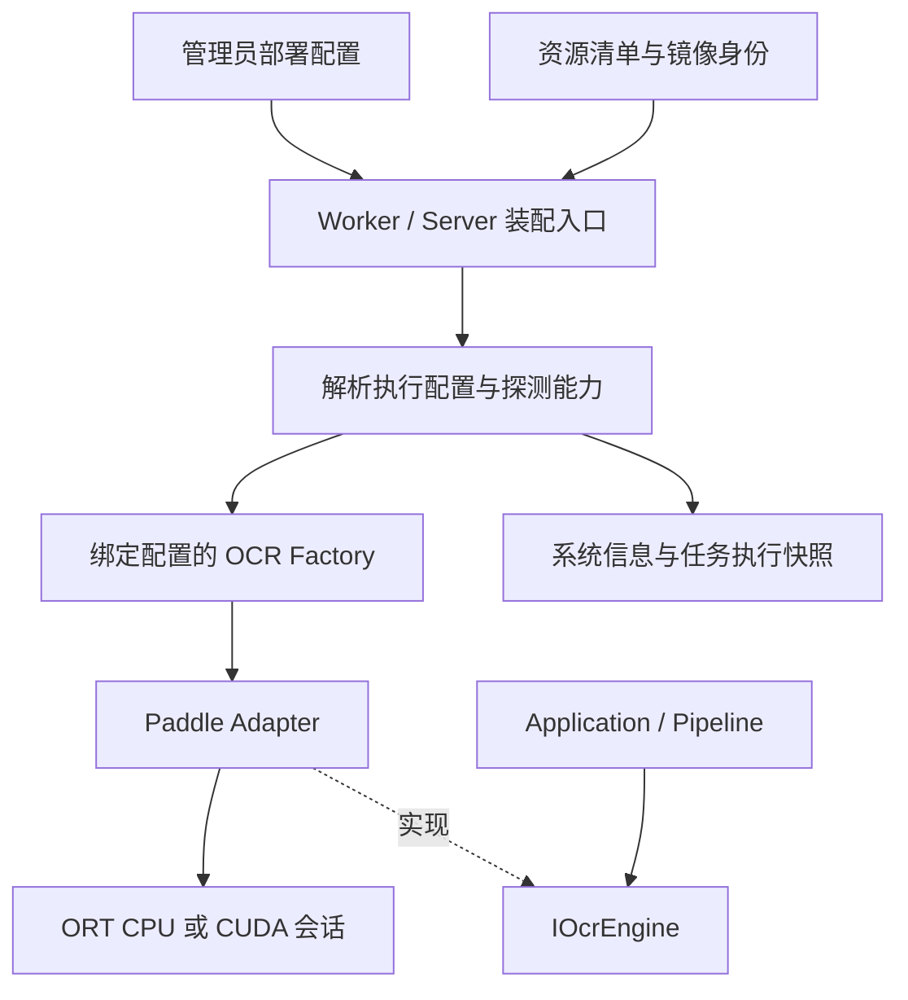

# Native GPU 执行后端与容器框架

> 状态：设计提案，2026-09-06；尚未实现、未引入依赖、未取得 GPU 验收结果。
> 本文响应“先设计框架”，不启动新 Phase，不改变 Phase 14 的 CPU-only 交付合同。
> 所有新增类型、字段、环境变量、文件名与命令均为拟议接口；现有版本不可直接使用。

## 1. 目标与第一版范围

同一套 SubLift Native 代码与 PP-OCRv6 模型，可通过部署配置在 CPU 或 NVIDIA GPU 上运行；
机器差异由镜像兼容条件和启动探测处理，不在代码、模型或任务中写死某台主机。

第一版交付 Linux x86_64、单容器、单个可见 NVIDIA GPU 的 Paddle CUDA 推理。
CPU 镜像继续支持既有平台；macOS Vision 保持原有平台执行方式。GPU 镜像只在通过验收的
GPU 架构、驱动与运行库组合内承诺支持，不将“一台机器测通”解释为所有 NVIDIA 显卡均可用。

第一版保持现有采样、ROI、行选择、共识、模型精度与批量参数。硬件视频解码、TensorRT、
FP16/量化、CUDA Graph、跨帧批处理、多 GPU 调度、AMD/Apple GPU 后端和自动选择后端后置。
这些能力有独立的质量或生命周期成本，不与首次 CUDA 接入叠加。

## 2. 当前实现与需要补齐的边界

| 当前事实 | 设计影响 |
|---|---|
| [IOcrEngine](../../cpp/include/sublift/ports/ocr.hpp) 借用 ImageView、返回 OcrResult，单实例串行 | 保持 Port 不变，GPU 类型不进入 Pipeline |
| [PaddleOptions](../../cpp/include/sublift/adapters/paddle.hpp) 只有模型、线程和 batch 参数 | 增加显式执行配置；不新增 paddle-gpu 引擎名 |
| [EngineFactory](../../cpp/src/worker/engine_factory.cpp) 绑定一个引擎 | 扩为绑定引擎与已解析执行配置，禁止任务偷偷改后端 |
| [JobManager](../../cpp/src/server/job_manager.cpp) 为任务创建 Factory/Bridge | 任务创建、持久化和执行时均携带后端身份 |
| [RegionDetector](../../cpp/src/server/region_detector.cpp) 有独立 Factory 与引擎缓存 | 智能选区必须走同一配置和 GPU 准入控制 |
| [manifest](../../resources/manifest.json) 的 ORT 按 os/arch 选择 | 新增 artifact 身份与 provider 选择，防止取到 CPU 包 |
| [CMake](../../cpp/CMakeLists.txt) 校验和打包主要 ORT 动态库 | 校验扩到选中 bundle 的 provider 库及完整依赖闭包 |
| 当前容器是 CPU ORT 1.18.1；历史 macOS 性能证据使用其他 ORT 构建 | 不将历史耗时或某个版本字符串当作 GPU 基线 |

依赖方向遵循 [Native 架构](../cpp/native-architecture.md)；失败策略遵循
[Runtime 契约](../cpp/runtime-contract.md)。

## 3. 分层与概念



区分三个概念：

- `engine`：识别算法，仍为 vision / paddle / mock。
- `provider`：Paddle 内部执行后端，第一版为 cpu / cuda；Vision 与 Mock 不接受此参数。
- `device_id`：CUDA 进程可见设备的逻辑编号；部署负责将宿主设备映射进容器。

采用小型、显式的 provider 分支，不建设动态插件加载系统或通用 GPU 调度框架。
未来增加后端时扩展已知枚举、私有注册实现、资源规格与验收矩阵；未知后端一律拒绝。

拟议自有类型放在 `cpp/include/sublift/core/ocr_execution.hpp`，不含 Ort/CUDA 类型：

```cpp
enum class PaddleProvider { Cpu, Cuda };

struct PaddleExecutionConfig {
  PaddleProvider provider{PaddleProvider::Cpu};
  std::optional<std::int32_t> device_id;  // CPU: null；CUDA: 容器内编号
};
```

`PaddleOptions` 组合此类型。Application factory 接口提供只读执行身份和请求校验；
具体 ORT provider 注册、设备探测与会话选项保留在 `sublift_paddle` 私有实现。
Core/Pipeline/Application 不链接 CUDA，CPU 构建不要求 CUDA 头文件或动态库。

Adapter 内部在创建任意 Ort::Session 前，根据已解析配置设置 SessionOptions：CPU 不注册
CUDA；CUDA 通过所选 ORT 版本的 C/C++ provider API 注册设备及固定选项，注册失败立即返回
错误。Det/Cls/Rec 使用相同执行配置，不在某一阶段单独捕获失败后重建 CPU Session。
首版沿用 FP32 模型，明确记录 TF32 等实际数学模式；具体开关随资源 profile 和质量门冻结，
不以“同为 FP32 输入”推断 CPU/GPU 数值完全等价。

## 4. 配置解析与任务快照

### 4.1 部署绑定

第一版一个 Server/Worker 进程绑定一个 Paddle provider 和一个设备。GPU 镜像绑定 CUDA，
CPU 镜像绑定 CPU；不在进程中动态加载或切换两套 ORT 库。

| 拟议输入 | 默认与校验 |
|---|---|
| `SUBLIFT_PADDLE_PROVIDER` / `--paddle-provider` | 未指定为 cpu；CUDA 镜像显式注入 cuda；仅 cpu/cuda |
| `SUBLIFT_PADDLE_DEVICE_ID` / `--paddle-device-id` | CUDA 未指定为 0；CPU 指定设备即报错；非负整数 |
| 构建与镜像 artifact 身份 | 必须与请求 provider、os/arch 匹配；不允许靠环境伪造能力 |

同一字段的显式启动参数优先于环境变量，环境优先于默认值；解析后整体校验。
GPU override 必须同时替换镜像、构建目标、provider 配置与设备申请，避免只申请 GPU。
没有 `auto` 模式；用户选择 CUDA 后缺设备、缺库或 OOM 不自动改为 CPU/Mock/Python。

HTTP 客户端不能修改管理员的 provider/device。创建任务可以省略 `paddle_execution` 以继承
当前部署，或提交相同值作为断言；不匹配返回 409，非法值/不适用引擎返回 400。
`engine=vision/mock` 不注入 Paddle 执行字段，也不将其标成 CPU OCR。

### 4.2 快照与迁移

任务创建时解析默认值并保存：requested/effective provider、device_id、模型 bundle 身份、
ORT artifact ID 与校验摘要、已解析推理选项指纹。执行时再校验当前能力；成功初始化后补充
实际设备信息与运行库身份。设备 UUID 不作为跨机器重跑的请求键，也不默认通过 Web 暴露。

排队期间配置不跟随环境变化。服务重启或迁移后，若 provider、设备或 artifact 与快照不符，
旧任务不得按新默认执行；要求用户显式重试，生成新任务及新快照。历史结果继续可读可导出。
活动任务沿用 interrupted 语义，不自动恢复 GPU 执行。

Job 持久化格式升为 v2：新程序读 v1/v2，写 v2；v1 的已完成任务执行身份记为
`legacy_unknown`，不伪造 GPU/CPU 历史。v1 未完成任务需显式重试后补全新快照。
迁移原子写并保留可恢复的旧版本副本；旧二进制拒绝 v2，不宣称可原地降级读取。

CLI/Worker 增加 `paddle_execution_v1` capability，并在握手返回绑定的执行身份。
显式 CUDA 客户端连接不支持该 capability 的 Worker 必须在 start_job 前失败。
CUDA Worker 拒绝未携带执行断言的旧客户端，防止旧端在不知情时改变输出后端。
既有 CPU/Vision 协议默认值保持兼容；Swift 暂不新增 CUDA UI，但需覆盖新增可选字段解码。

## 5. 能力探测与失败语义

`available` 表示该进程按指定配置真实可运行，不等同于编译宏为真、发现显卡或库文件存在。

启动顺序：

1. 解析配置、确认镜像 provider 与平台匹配。
2. 校验模型、主 ORT 与 provider bundle 身份，并验证依赖可加载。
3. CUDA 检查可见设备、驱动兼容性与设备支持情况。
4. 对 Det/Cls/Rec 建立真实会话，使用版本化小 fixture 完成推理和输出形状/有限值检查。
5. 以 ORT profiling 校验三阶段存在 CUDA 计算；释放探测会话后发布能力快照。
6. 非 loopback Server 的所选 Paddle 后端不可用即拒绝启动；loopback 可保留诊断 API，
   但相关提取与智能选区请求拒绝执行。

探测不在每次 GET system/info 时重复加载模型；该接口读取带探测时间和配置指纹的快照。
运行时失败使快照失效，下一次任务前重新探测。探测耗时单独计入冷启动。

ORT 可将部分节点分配到 CPU，因此本设计区分：

- **禁止的后端降级**：CUDA 初始化失败后重建纯 CPU 会话，或三阶段实际全在 CPU 执行。
- **可审计的图内 CPU 节点**：同一 CUDA 会话中存在经模型/provider 验收记录的辅助节点。
  分配依据实际 profiling 审阅；不得仅靠 CUDA 注册成功或 nvidia-smi 就宣称 GPU 推理。

第一版 Det/Cls/Rec 都要求有 CUDA 计算，若某阶段不满足则候选不通过，不自行改成混合阶段
策略。固定 fixture 与多源长流共同覆盖不同输入形状；不宣称一次探测穷尽所有形状。
该区分依据 [ORT 的节点分配机制](https://onnxruntime.ai/docs/execution-providers/)。

| 错误代码（拟议） | 行为 |
|---|---|
| `provider_not_built` / `artifact_mismatch` | 构建或启动失败，提示所需镜像/资源身份 |
| `provider_library_missing` / `driver_incompatible` | 标记不可用，不启动提取 |
| `device_unavailable` / `device_unsupported` | 指明设备选择或兼容矩阵问题 |
| `provider_inference_failed` | 探测或任务失败，保留阶段与可执行诊断 |
| `gpu_out_of_memory` | 任务失败，释放资源，能力重新检查，不自动改 batch/设备/provider |
| `gpu_busy` | 智能选区返回 409，可由用户稍后重试，不自动切 CPU |

以上配置错误在 HTTP 入队前返回 400/409，不可用返回 503；入队后故障写入任务终态和 SSE。
启动失败退出码非零。UI 展示简明错误，底层路径和库加载细节留在受控日志。

## 6. 会话、并发、取消与内存

第一版沿用每任务持有 OCR 会话，暂不同时引入跨任务会话缓存或跨帧异步推理。
输入 ImageView 的借用规则保持不变：recognize 返回前完成必要同步，随后不得引用输入像素。

CUDA 宿主增加一个共享、可取消的 `OcrExecutionGate`，只负责并发准入，不承担业务调度：

- 提取任务从 GPU 会话创建前到会话销毁后持有独占 lease；只在获得 lease 后创建会话。
- 智能选区覆盖整个选区操作持有同一 lease，使用同一 Factory 配置；CUDA 选区结束释放
  会话，不沿用当前 RegionDetector 的常驻缓存，以免与提取重复占用显存。
- 智能选区占用期间队列等待 lease；提取占用期间新的选区请求立即返回 gpu_busy。
  已等待提取任务优先，防止连续选区请求使队列饥饿；不持有 JobManager 锁等待 lease。
- 探测同样使用 gate；Web system/info 读取缓存，无额外 GPU 会话。
- gate 只协调本进程，不声称独占整张物理 GPU；多个容器或外部进程竞争可能导致 OOM。

取消必须停止新帧和新推理提交，并等待当前调用安全结束后释放会话与 lease，抑制迟到结果。
设备丢失/ORT 严重错误后不复用故障会话。只有 GPU 调用已结束，才可向新任务授予 lease。
不能把取消标志设置成功当作 GPU 已停止。

现有 [Worker 取消要求](../cpp/worker-ipc-contract.md) 仍作为验收目标（1 秒停止有效工作、
5 秒允许重启）。若同步 GPU 调用无法满足，需另行设计可隔离的 Native 执行进程后再交付；
不得默认强杀 Web Server 或谎报快速取消。

先记录进程显存峰值，不把 ORT 的 arena 限额宣传为整个 GPU/进程的显存硬上限。
线程数、batch 与精度选项由版本化 profile 固定，不向 Web 暴露任意 ORT 参数透传。

## 7. 资源清单与原生构建

新增 manifest v2；新读取器兼容 v1（解释为既有 CPU artifact），既有 CPU 清单暂保留 v1。
CUDA 镜像选用独立 v2 清单并显式设置 SUBLIFT_NATIVE_MANIFEST，避免旧安装器误选 GPU 条目。

v2 ORT artifact 的逻辑键：`artifact_id + os + arch + provider`。
部署/构建指定 artifact_id；同一键重复、字段缺失或匹配歧义均失败，禁止取第一个 URL。

| 字段组 | 内容 |
|---|---|
| 身份 | artifact_id、os、arch、provider、ORT version、来源与归档 SHA |
| 文件闭包 | 主 ORT、provider_shared、provider_cuda 等实际随包库的相对路径与各自 SHA |
| 运行依赖 | 已选包要求的 CUDA/cuDNN 版本；基础镜像 digest 和系统包版本记录 |
| 兼容规格 | 最低驱动、支持的 GPU compute capability 范围、目标 CPU/ABI；来自所选构建的证据 |
| 验收身份 | 模型摘要、会话选项 profile、探测 fixture 版本 |

CMake 与安装器共同使用显式 artifact 选择：不仅检查“某个主库 SHA 出现在清单中”，还要
校验它属于当前选中的 bundle。安装按平台/provider/artifact_id 分目录，临时下载、全量
校验后原子完成。归档路径不得逃逸，库 symlink 必须解析到已校验文件；不从任意搜索路径
补齐缺失 provider。显式 manifest 无效时直接失败，不继续查找另一份 CPU 清单。

拟议 `SUBLIFT_ENABLE_CUDA=OFF` 默认关闭。启用时要求 Linux x64、Paddle 和匹配的 GPU ORT
开发包；缺项 CMake 配置失败。ORT/CUDA 类型与链接保持私有，打包完整 provider 库，运行时
验证实际装载身份，防止复制主库后误用系统 provider。

优先使用有来源与 SHA 的原生 GPU 开发包；不存在合适包时，另行审查固定源码构建方案。
不得从 Python wheel 取 ORT。具体 ORT/CUDA/cuDNN/基础镜像版本尚未选定，需目标 GPU 与
驱动信息后冻结，不能仅由当前 CPU ORT 版本推导。兼容关系查
[ORT CUDA 官方表](https://onnxruntime.ai/docs/execution-providers/CUDA-ExecutionProvider.html)。

## 8. 容器部署与跨机器迁移

建议在现有 Dockerfile 增加独立 GPU 资源/构建/runtime target，共享 Web 和通用构建步骤。
默认构建仍落到 CPU target；GPU target 必须显式选择，基础镜像按 digest 固定。
实际镜像名拟为 `sublift:local-cpu` 与 `sublift:local-cuda`，均本机构建，不引入发布流程。

新增拟议 `docker-compose.gpu.yml` override：

```yaml
services:
  sublift:
    build:
      context: .
      dockerfile: Dockerfile
      target: runtime-cuda
    image: sublift:local-cuda
    environment:
      SUBLIFT_PADDLE_PROVIDER: cuda
      SUBLIFT_PADDLE_DEVICE_ID: "0"
      SUBLIFT_NATIVE_MANIFEST: /opt/sublift/share/sublift/manifest.cuda.json
    deploy:
      resources:
        reservations:
          devices:
            - driver: nvidia
              device_ids: ["${SUBLIFT_GPU_DEVICE:-0}"]
              capabilities: [gpu]
```

目标用法（相关 target、override 和清单尚未实现）：

```sh
docker compose -f docker-compose.yml -f docker-compose.gpu.yml up --build -d
```

`SUBLIFT_GPU_DEVICE` 只由 Compose 解释为宿主设备选择；容器只暴露该设备，内部逻辑编号为 0，
不得把宿主编号直接透传给 ORT。启动探测需核对该映射。迁移时更换部署变量即可；应用和
模型无需写入主机名、PCI 地址或设备 UUID。Compose 的设备 reservation 语义见
[Docker 官方文档](https://docs.docker.com/compose/how-tos/gpu-support/)。

宿主提供兼容的 NVIDIA 驱动、Container Toolkit 与 Docker runtime 配置；镜像提供用户态
CUDA/cuDNN 和 ORT，不在镜像安装宿主内核驱动，也不要求宿主安装完整 CUDA SDK。
安装职责见 [NVIDIA Container Toolkit](https://docs.nvidia.com/datacenter/cloud-native/container-toolkit/latest/install-guide.html)。

继续沿用 non-root、/media 唯一授权根、工作区锁定与 token 合同；无需 privileged 模式、
Docker socket 挂载或额外端口。CPU 部署不需要 NVIDIA 软件。将 GPU 容器移到无兼容 GPU
的机器会失败；管理员可显式重新部署 CPU 镜像并新建任务，不称为同任务自动降级。

## 9. 系统信息与产品呈现

在既有 `/api/system/info` 的 Paddle 条目增加可选 `execution` 对象：

```json
{
  "provider": "cuda",
  "device_id": 0,
  "device_name": "来自运行时探测",
  "state": "ready",
  "artifact_id": "来自已选清单",
  "probe_time": "实际探测时间"
}
```

上例是字段示意，不是实测响应。状态为 ready / unavailable / needs_reprobe，busy 属于
运行态单独显示，不将占用误报为硬件不可用。旧服务未返回 execution 时，UI 显示“后端信息
不可用”，不猜测 CPU。新服务仅在探测通过后标 ready；GPU 任务要求实际会话成功后才记录
执行成功身份。

Web 显示“Paddle · NVIDIA GPU”与设备名，任务详情显示已冻结 provider；第一版不提供
远程切换设备、下载安装 CUDA 或修改部署后端的按钮。单视频、批量与智能选区使用相同语义。

## 10. 验收与性能实验

默认 `verify-product.sh` 保持无 GPU 可运行；既有 CPU 容器门保持独立。
拟议 `verify-container-gpu.sh` 是额外 Python-free 门，无 Docker/GPU/真实素材时显式
SKIPPED 且非成功退出（建议 2），不以 mock 代替 CUDA 验收。

| 验收层 | 必须证明 |
|---|---|
| 配置与资源 | 默认 CPU、非法枚举/设备、artifact 歧义、库缺失/SHA 错误、v1/v2 读取、CPU 无 CUDA 依赖 |
| 协议与恢复 | 新旧握手、CUDA capability 缺失拒绝、单/批量快照一致、迁移后不自动换后端 |
| 真实 GPU | Det/Cls/Rec 执行与节点 provider 证据，实际库身份，智能选区与提取同后端 |
| 生命周期 | gate 无死锁/饥饿、选区 busy、排队取消、运行取消、OOM、设备不可用、连续任务显存不累计 |
| 产品 | /media 沙箱、锁定、鉴权保持，真实媒体经 Web/API 提取并可导出 SRT |
| 可移植性 | 兼容表中至少两种 GPU 型号实跑；未测试型号标为未验证，不声称全覆盖 |

质量验收分两层：CPU 路径与既有 golden 保持 exact；GPU 候选先记录与 CPU 的逐源 SRT hash
和全部质量差异，不要求浮点 tensor 跨硬件逐位相同，也不自动放宽现有产品门。
GPU 产品基线须单独版本化、人工审阅差异并通过已批准的多源 GT 门后冻结；在此之前 GPU
交付不通过。绝对质量阈值至少沿用现有多源门，各源 CER、漏检、noise/empty 不得由平均值
掩盖；若需引入硬件数值容差，需先证明不影响接受的字幕行为，不能用新 golden 消除失败。

性能用同一宿主、同媒体/ROI/fps/模型/选项、同版本同来源系列 ORT 的 CPU/GPU 对照，
预热至少 1 次，交错测量至少 3 次，主要报告 median。若 GPU ORT 必须升级，另报告当前
已发布 CPU 版本的产品对照，分离 ORT 升级收益和 GPU 收益。
记录完整 job wall、首条时间、初始化、Det/Cls/Rec、传输/前后处理、OCR 调用数、RSS、显存、
设备/驱动/镜像 digest。阶段诊断与默认产品 wall 分开测，避免 profiling 开销污染结论。

验收素材包含短片、密集字幕长片、稀疏字幕、Latin/混排及不同 ROI 尺寸；取消时延仍需过门。
建议性能目标为目标服务器上密集字幕负载端到端 median 至少降低 20%；这是待冻结目标，
不是已测收益。GPU 支持可用性与加速结论分别记录，只有实测通过才宣称加速。

## 11. 实施拆分与待冻结输入

建议未来作为“可移植 GPU 字幕提取”新 Phase 的四个纵向 Deliverable，顺序推进：

| 拟议 Deliverable | 独立可验收结果 |
|---|---|
| 配置与 CPU 兼容 | 新后端模型、快照、资源读取与能力合同落地，CPU 现有产品行为不退步 |
| 原生 CUDA 提取 | 固定 GPU 资源、真实三阶段推理、失败语义与 Native 单视频输出通过质量门 |
| GPU 容器工作台 | GPU 镜像/Compose、Web 信息、智能选区与队列准入完整闭环 |
| 多机质量与性能 | 两种 GPU 兼容证据、长流/取消/恢复、质量基线、性能与运维说明齐备 |

CUDA 资源锁定与真机验收前需要冻结：目标服务器 OS/CPU 架构、GPU 型号/显存、驱动版本；可用原生
ORT GPU 包及完整哈希；对应 CUDA/cuDNN/基础镜像；质量比较阈值与 GPU 性能目标。
当前缺少这些机器信息不影响框架设计，但不据此杜撰可部署版本、显存最低值或性能承诺。
配置模型、CPU 兼容与资源选择接口可先独立实现和验证，不依赖 GPU 真机。

新增第三方运行库与资源 schema 的实际修改仍按项目契约在实施前确认；本文不修改既有
manifest、ADR、阶段状态或验收 evidence。未来决策采纳时再登记 ADR 与新 Phase，不能扩张
已完成的历史 Phase。
