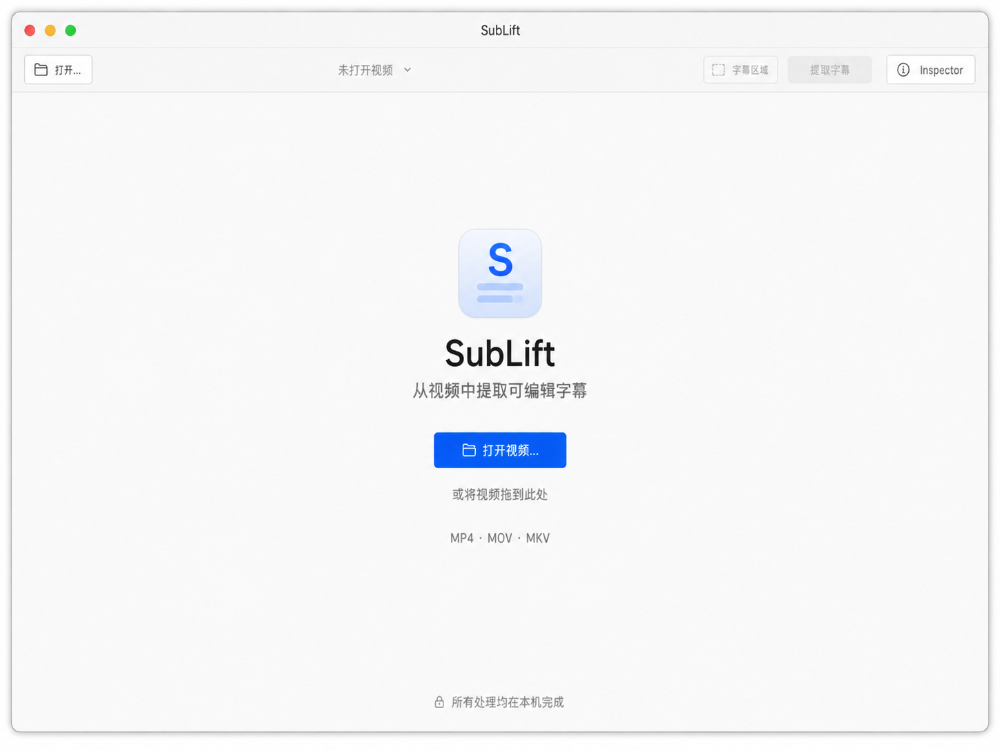
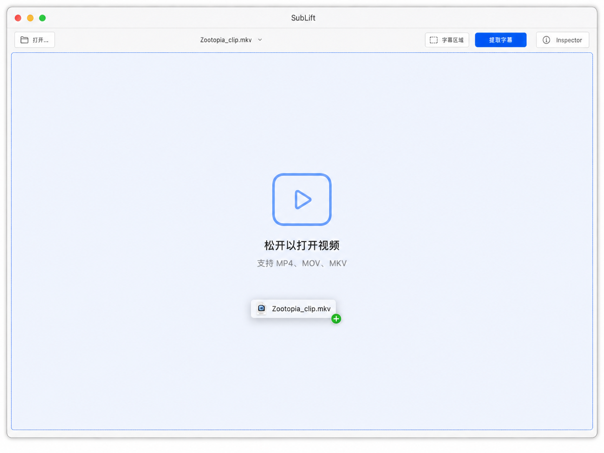
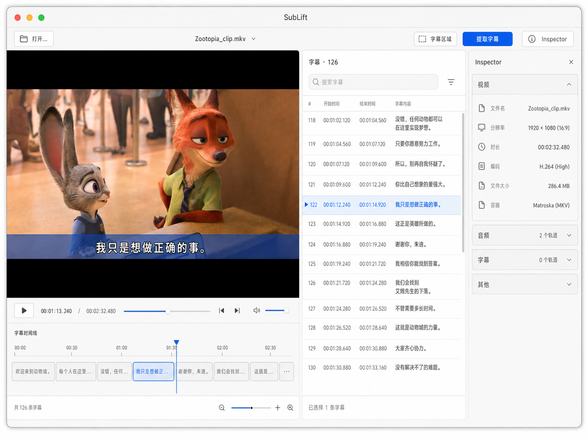
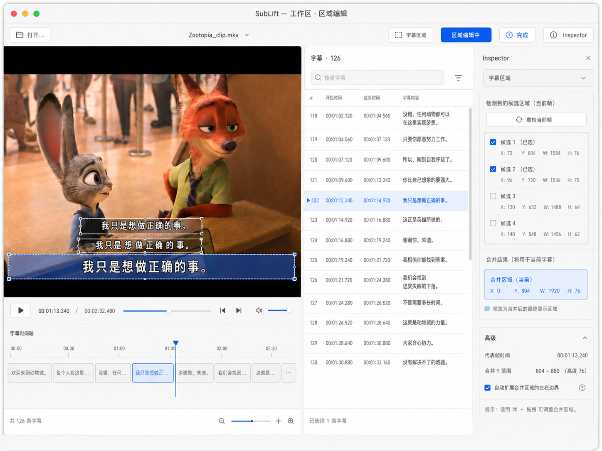
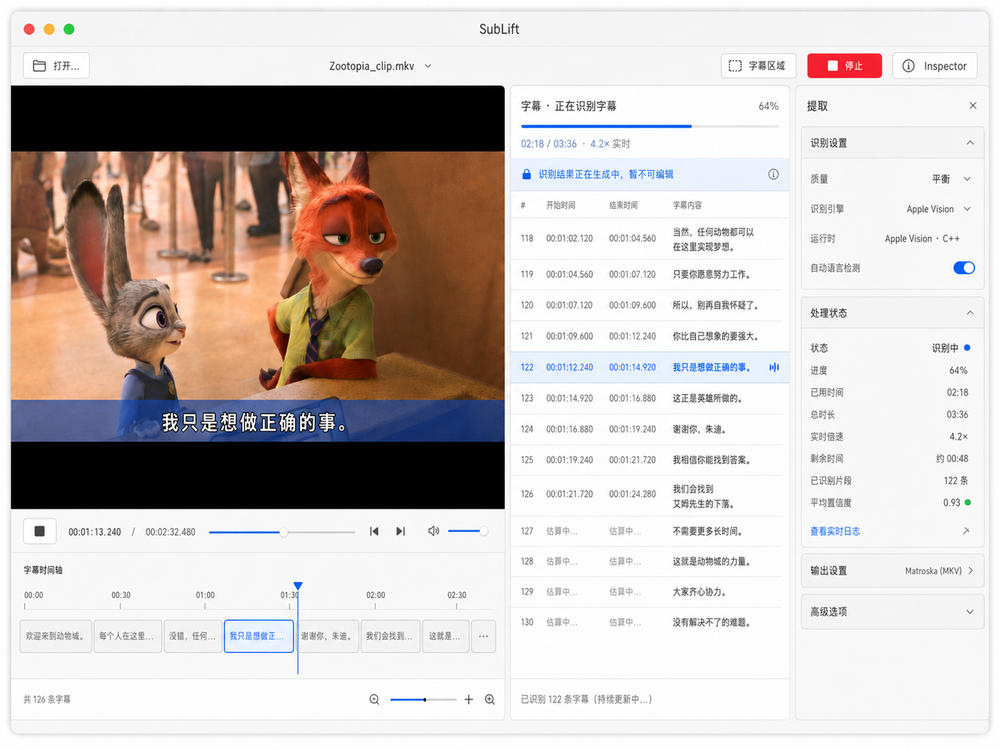
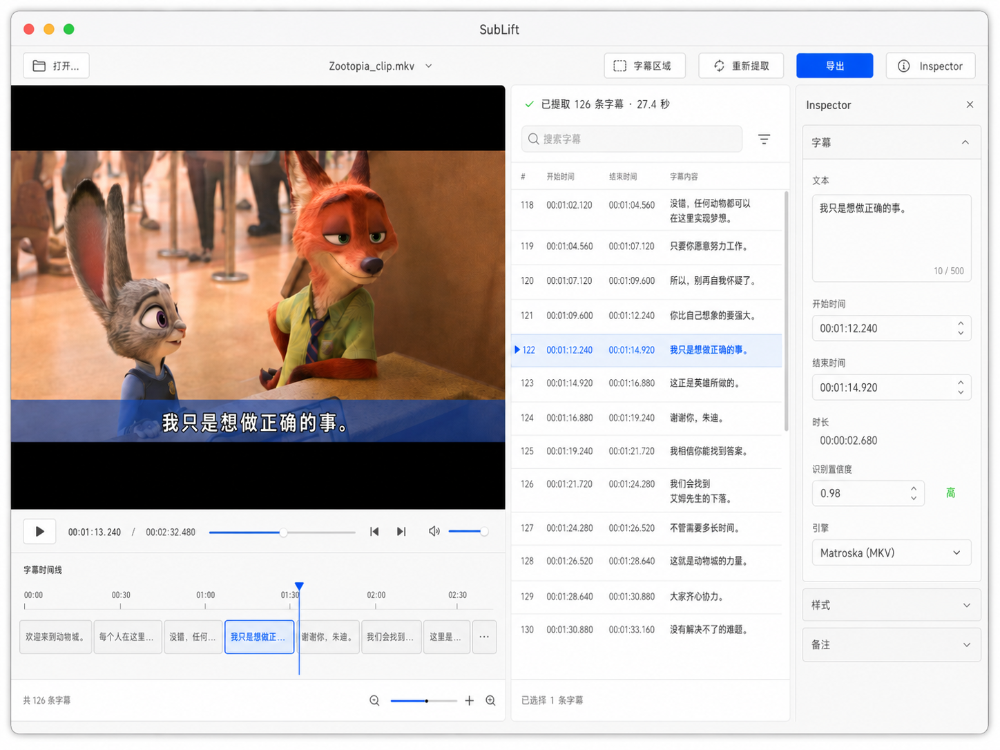
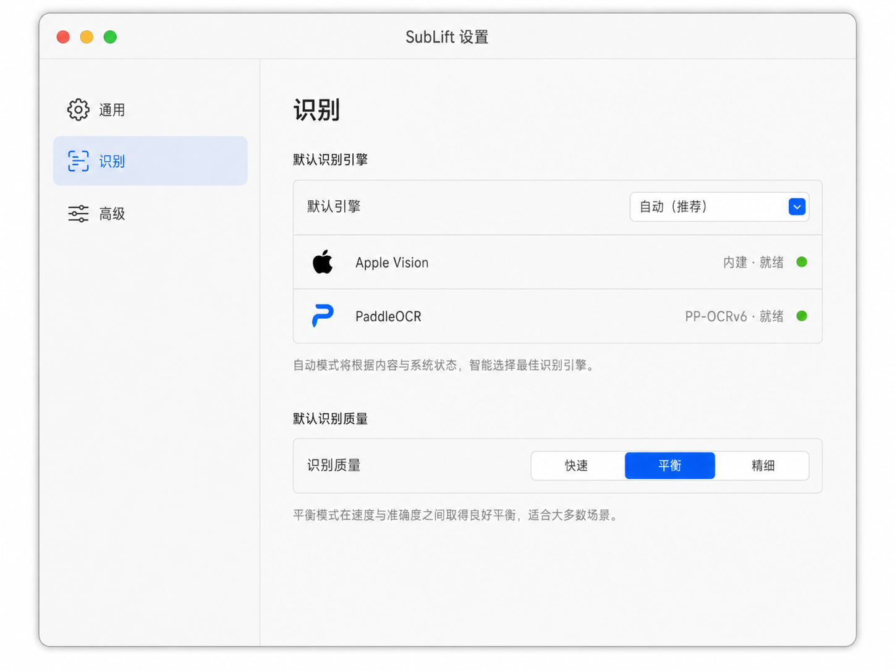

# 主设计方案：SubLift macOS Subtitle Workbench vNext

> 状态：Phase 10 设计基线
>
> 目标平台：macOS 13+ / SwiftUI
>
> 核心工作流：导入视频 → 确认字幕区域 → 提取 → 校对 → 导出 SRT

## 1. 产品定位

SubLift 应呈现为一个 **Native macOS Subtitle Workbench**，而不是 AI SaaS Dashboard、参数面板或简化视频编辑器。

视觉层级始终遵循：

1. 视频与字幕是内容主体；
2. 当前任务的主动作位于 Toolbar；
3. Session 上下文进入 Inspector；
4. 跨 Session 的持久偏好进入 Settings；
5. OCR、Runtime 和诊断能力按普通用户 / 高级用户分层展示。

## 2. 设计原则

- **内容优先**：工作区不持续展示品牌 Hero，不使用永久左侧 Sidebar。
- **原生优先**：优先使用系统 Toolbar、Split View、Inspector、List/Table、Settings、Menu Commands、Save Panel 与 Alert。
- **渐进披露**：常用动作直接可见；候选几何、runtime、模型与诊断信息进入 Inspector 或 Advanced。
- **能力真实**：界面只展示当前运行时真正提供的状态和数据，不用占位入口假装功能已完成。
- **状态连续**：处理时不离开工作区；视频、实时字幕、进度和取消始终处于同一 Session。
- **编辑安全**：流式字幕在 processing/finalizing 阶段只读，最终 `entries` 落地后才进入可编辑状态。
- **系统语义**：颜色、字体、间距、选择和焦点依赖系统语义值，自动适配浅色/深色、Accent Color 和辅助功能设置。

## 3. 信息架构

当前产品只需要四类 Surface：

| Surface | 所有权 | Phase 10 状态 |
|---|---|---|
| Main Workspace Window | 一个视频 Session 的导入、区域、提取、校对与导出 | 实施范围 |
| Context Inspector | 当前视频、区域、提取或字幕的上下文 | 实施范围 |
| Settings Window | 跨 Session 的质量、引擎与开发者偏好 | 实施范围 |
| Task Center Window | Phase 8 批量任务与队列 | Phase 10 不实现；Phase 8 已规划、尚未交付 |

Export 继续使用 `NSSavePanel`；依赖错误和阻断错误使用 inline、sheet 或 alert，不新增 Web 式页面。

## 4. 主窗口结构

```text
macOS Titlebar + Toolbar
┌────────────────────────────────────────────────────────────────────┐
│ Open        current filename       Region / Extract / Export      │
├──────────────────────────────┬───────────────────┬─────────────────┤
│                              │                   │                 │
│      Video Workspace         │ Transcript Panel  │ Inspector       │
│                              │                   │ (optional)      │
├──────────────────────────────┤                   │                 │
│ Transport + Subtitle Track   │                   │                 │
└──────────────────────────────┴───────────────────┴─────────────────┘
```

- Inspector 关闭时：Video Workspace 约 60–65%，Transcript 约 35–40%。
- Inspector 打开时：宽 280–360 pt，可调整；不得压缩视频到不可用尺寸。
- 理想窗口约 1280 × 800 pt；Phase 10 验收最小窗口为 960 × 600 pt。
- 变窄策略：先隐藏 Inspector，再把 Transcript 缩到约 320 pt；不把全部控件压成多行工具面板。

## 5. Surface 规范

### 5.1 Welcome / Empty



- 保留标准标题栏和简洁 Toolbar；只启用 Open。
- 主内容宽 420–520 pt，展示应用图标、名称、说明、`打开视频…`、拖拽提示和已支持格式。
- 底部弱化显示“所有处理均在本机完成”。
- 不使用大 Hero、渐变背景、整窗虚线 DropZone 或 Dashboard Card。

### 5.2 Drag Active



- 合法视频进入时，整块可接收区域使用 1.5–2 pt Accent 边界和极浅 Accent tint。
- 空工作区文案为“松开以打开视频”；已有视频时为“松开以打开新视频”。Phase 10 不承诺自动创建第二窗口。
- 非法扩展名拒绝接收，并通过辅助文本/VoiceOver 给出原因；状态不能只靠颜色表达。

### 5.3 Workspace / Ready



- Toolbar：Open、当前文件名、字幕区域、提取字幕、Inspector。
- `提取字幕` 是 ready 状态的唯一主要动作；OCR 与质量 Picker 不常驻 Toolbar。
- Video Canvas 黑底、aspect fit；非区域编辑模式只显示最终有效字幕区域。
- Transcript 顶部为条数、搜索框和必要的筛选入口；主体使用标准 List/Table 行，不为每条字幕套 Card。
- 字幕行显示序号、等宽时间码、正文；当前播放与选中状态分别表达。

### 5.4 Region Editing



- 进入后 Toolbar 显示明确的“区域编辑中”状态与“完成”。
- Inspector 自动切换到 Region；候选选择、重检和合并结果从主内容移入 Inspector。
- 所有候选使用统一语义色：未选中为 secondary outline，hover 为 Accent outline，选中为 Accent outline + tint，merged region 使用更明确的 Accent outline。
- 正常模式隐藏候选编号和几何数据；代表帧、X/Y/宽高、置信度放在“高级信息”披露区。
- 保持 `RegionSelectionModel` 的全宽合并和 source-frame 坐标契约，不改变 Worker ROI 语义。

### 5.5 Workspace / Processing



- 工作区保持原位，视频仍可查看和 seek；Toolbar 的主动作切换为“停止”。
- Transcript Header 下显示真实阶段、百分比、已处理/总帧或可从现有数据推导的进度、实时倍速和 `runtimeIdentity`。
- 不显示当前 API 无法可靠提供的“剩余时间”或伪造的平均置信度。
- `push_entry` 流式结果可选择、seek、浏览和搜索，但不可编辑、拆分、合并或导出。
- finalizing 继续保持只读；停止/失败后必须能重新开始，迟到消息不能污染新任务。

### 5.6 Workspace / Review



- 最终结果落地后短暂显示完成摘要，随后进入稳定的 Review 状态。
- Toolbar 为字幕区域、重新提取、导出；导出成为主要动作并继续直接打开 SRT Save Panel。
- Transcript 恢复文本编辑、拆分、合并与上下文菜单。
- 选中字幕时 Inspector 显示真实存在的文本、start/end/duration、confidence 和实际引擎/runtime 身份。
- 参考图中的时间微调字段可建立布局，但只有现有 `SubtitleEditor` 行为和测试覆盖后才能启用；不得提前展示不可用控件。

## 6. Transcript 体验

### 行布局

```text
122   00:01:12.240 → 00:01:14.920     [低置信警告，仅必要时]
      我只是想做正确的事。
```

- 单击：选择并 seek。
- 双击：仅在 Review 状态进入文本编辑。
- 右键：Edit、Split、Merge with Next、Copy Text、Reveal at Playhead；按状态禁用不安全命令。
- 搜索：只过滤或定位当前已加载字幕，不修改原始顺序；清空搜索恢复完整列表和当前播放定位。
- 当前播放：左侧 2–3 pt Accent indicator；选中：系统 selection。两者同时存在时仍可辨别。
- 低置信：使用 warning 图标和辅助文本，不永久展示每行数值。

## 7. 轻量字幕时间线

Subtitle Timeline 是媒体体验增强，不是剪辑时间线：

- 高 28–40 pt，每个字幕以 `startMs/endMs` 映射为可点击块；
- 显示播放头与当前字幕；点击块 seek 到字幕开始；
- 处理时随流式结果增量出现，最终结果替换后重绘；
- 极短条目有最小可点击宽度，但其时间比例仍通过位置表达；
- 不提供拖拽改时、缩放编辑、轨道管理或波形。

## 8. Context Inspector

Inspector 根据上下文切换，而不是成为永久参数面板：

| Mode | 内容 | 切换条件 |
|---|---|---|
| Video | 文件名、分辨率、时长、编码、大小、容器、预览兼容性 | 视频载入后默认 |
| Region | 检测状态、候选选择、重检、合并区域、高级几何 | 进入区域编辑 |
| Extraction | 质量、引擎、实际 runtime、真实处理状态 | ready/processing，用户主动查看 |
| Subtitle | 文本、时间、时长、confidence、实际引擎 | Review 中选中字幕 |

Inspector 关闭时完全释放内容空间。切换视频、开始处理、结束处理、取消和选择字幕时必须有确定的模式转换，详见交互状态规范。

### 8.1 快速提取设置栏（10415 实施补充）

- 位于视频工作区的提取状态区下方，使用约 52–64 pt 的两行紧凑布局，不进入 Toolbar 或 Inspector。
- 与 Settings 共用 OCR 引擎、采样质量和 Developer Mode 偏好；WorkspaceModel 只保存任务启动时的 active 快照和最近成功结果的 final 快照。
- starting/processing/finalizing 与 Region Editing 中控件禁用但值可读；偏好变化不追溯当前任务，也不自动启动提取。
- 已有最终结果且偏好变化时显示文字化待生效提示与“重新提取”；Toolbar 和该按钮共用同一替换确认入口。
- 非开发模式隐藏并归一化 Mock；不增加 Automatic、Whisper、ETA、平均置信度或模型下载入口。

## 9. Settings



Settings 从 App Menu / `⌘,` 打开，不在主 Toolbar 放设置按钮。

### General

- 默认识别质量：快速 / 平衡 / 精细；继续映射现有 `SamplingQuality`。
- 只放已经生效的跨 Session 通用偏好。

### Recognition

- Apple Vision 与 PaddleOCR 的默认选择和可用状态。
- “自动 / 推荐”只有在产品定义了可测试的路由语义后才能加入；Phase 10 不把它静默等同于 Vision。
- 模型缺失使用 inline 状态；Phase 10 不新增下载器。

### Advanced

- Mock 仅在 Developer Mode 下可见。
- C++ 是产品默认，Python 仅显式 Oracle/开发回滚；界面不得提供违反 fail-closed 契约的静默 fallback。
- Reveal Logs / Copy Runtime Information 只有在实现了确定的日志路径与脱敏格式后才启用。

## 10. Menu 与键盘

| 菜单 | Phase 10 命令 |
|---|---|
| File | Open Video…、Export SRT…、Close |
| Edit | 系统编辑命令、Split Subtitle、Merge with Next |
| Playback | Play/Pause、Previous Subtitle、Next Subtitle |
| View | Show Transcript、Show Inspector、Edit Subtitle Region |
| SubLift | About、Settings…、Quit |

`Space` 继续播放/暂停；命令的 enabled 状态必须与 Workspace 状态一致，并复用同一 action，不允许 Toolbar、菜单和上下文菜单各自实现业务逻辑。

## 11. 视觉系统

### 颜色

使用系统语义颜色：primary、secondary、tertiary、window/control background、selection、Accent Color，以及必要的 red/orange/green。禁止把固定蓝色当作品牌/交互真源。

### 字体

- 页面/空状态标题：系统 title/title2；
- Section：headline；正文：body；辅助信息：callout/caption；
- 时间码与数字进度：monospacedDigit。

### 间距与圆角

- 采用 4 / 8 / 12 / 16 / 24 / 32 pt 间距序列；
- 普通内容不做 Card；系统控件使用系统圆角；
- Video Canvas、Drop target 和少量 overlay 才使用明确圆角。

### 材质

Toolbar / Inspector chrome 可随系统获得材质；字幕行、Settings form 和内容区域不主动“玻璃化”。macOS 13+ 上保持平台对应版本的原生外观。

## 12. 辅助功能与适配

- Light/Dark、系统 Accent、Increase Contrast、Reduce Transparency、Reduce Motion 均需可用；
- 状态由图标/文字/形状共同表达，不依赖颜色；
- Region、Transcript row、Progress、Timeline block 和 Toolbar action 有明确 accessibility label/value；
- 键盘可完成打开、播放、显示 Inspector、区域编辑、字幕定位、上下文编辑和导出；
- 动态布局不得裁切主动作、搜索框、时间码或错误恢复入口。

## 13. 明确非目标

Phase 10 不包含：

- Task Center、批量处理队列或任务持久化；
- Whisper/ASR、新 OCR Provider、真正的自动引擎路由；
- ASS/VTT 导出、格式 Wizard；
- 模型下载器、云服务或在线账号；
- 复杂剪辑时间线、波形、拖拽改时；
- `DocumentGroup`、视频写回或 Session 持久化；
- 独立 `.app` 分发、签名、公证；
- 修改 C++/Python Pipeline 算法、UDS framing 或默认 runtime/fail-closed 策略。

第 8 张 Task Center 参考图已由 Phase 8 的 08001 转化为独立设计/架构合同；Phase 10 的非目标
保持不变。只有 08102–08410 建立真实队列模型并通过验收后，产品才启用入口。
