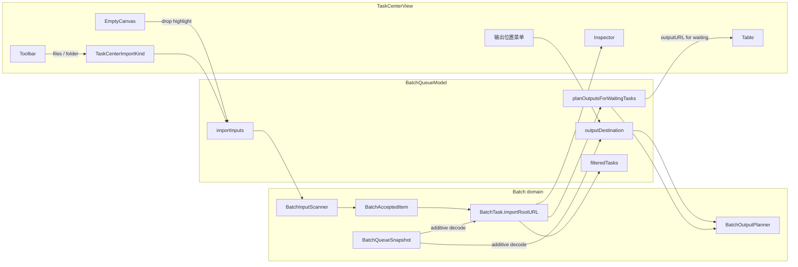
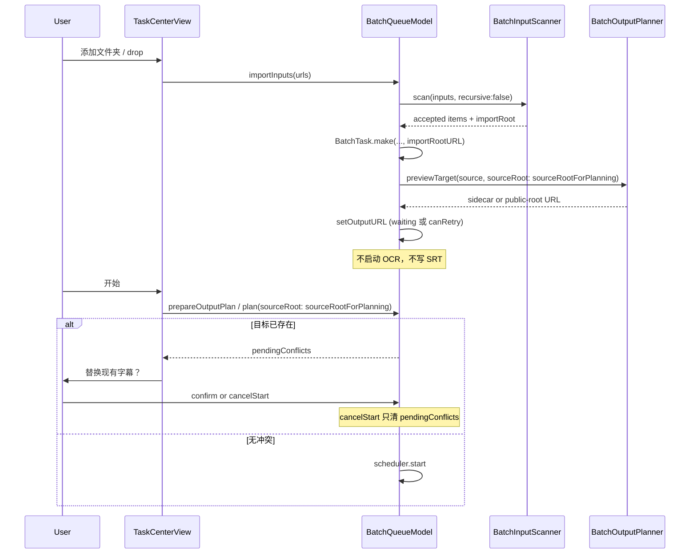

# Task Center v2：信息层级与导出可见性（08511）

| 字段 | 值 |
|---|---|
| Feature | **08511**（Phase 8 后续，不新开 Phase 11，不占用 09101） |
| 作者 | SubLift design |
| 日期 | 2026-08-13 |
| 状态 | Accepted（2026-08-13，用户确认 Q1=Yes、Q2=Yes） |
| 类型 | 父合同附录（addendum），不是调度 / 输出安全重写 |
| 父合同 | [`batch-task-center.md`](batch-task-center.md) |
| 实施计划 | [`../plans/features/08511.md`](../plans/features/08511.md) |
| 分支约束 | 本 Feature 落在 `feat/task-list` 的 Task Center / `Batch*` 范围；避开并行校正分支对 `WorkspaceRootView` / 非必要 `EvidenceShot` 的改动 |

本文是实施合同。实现 Agent 应按文中冻结的类型、状态机、文件路径与验收编写 RED 测试后再改产品代码。未列入的行为沿用父合同 08001–08410。

---

## Overview

Phase 8（08001–08410）已经交付独立 Task Center、统一扫描、串行队列与 sidecar SRT。当前窗口在四个产品点上不合格：空态把 Table 斑马纹露出来，且空态上的蓝色「添加文件」因双 `.fileImporter` 经常点了没反应；文件夹导入后表格只显示 `lastPathComponent`，看不出视频属于哪个文件夹；底栏 Inspector 是带重复「配置 / 引擎 / 质量」标签的字段堆，和上方孤立的删除/上移/下移条叠在一起；输出列在点「开始」前一直是「—」，用户无法确认 SRT 会写到哪里。

08511 只改 Task Center 的信息层级、导入归属、输出预览与 Inspector 编排。调度、Worker、冲突策略默认值、fail-closed 与双组合根不变。默认输出仍是 sidecar（用户已确认 Q1=Yes）。PR2 先修 `BatchOutputPlanner` 相对路径并落地队列级 `outputDestination`；PR5 接线公共根 UI（用户已确认 Q2=Yes）。

---

## Background & Motivation

### 当前实现（已对照源码，2026-08-13，`feat/task-list`）

空态在 `TaskCenterView` 的 `ZStack` 里叠在 `TaskTableView` 上面（`TaskCenterView.swift` 39–58、372–396 行）。`summary.total == 0` 时 Table 仍渲染，斑马纹会透出来。蓝色 `Button("添加文件")` 只是把 `isImportingFiles = true`，与 Toolbar 相同。同一 View 上挂了两个 `.fileImporter`（文件 + 文件夹）。这是已知 SwiftUI 陷阱：后挂的 importer 会吞掉前一个的 present。这是空态蓝按钮「没用」的最可能原因，不是 hit-testing 或 Toolbar 缺失。Toolbar 已有「添加文件 / 添加文件夹」。

文件夹归属在入队时被丢掉。`BatchInputScanner.scan` 返回扁平的 `BatchScanSummary.accepted: [URL]`。`BatchQueueModel.importInputs` 对每个 URL 调用 `BatchTask.make(sourceURL:…)`，不记录是哪个输入文件夹产出来的。`BatchTask` 只有 `sourceURL`。表格「文件」列是 `task.sourceURL.lastPathComponent`（`TaskTableView.swift` 10–16 行）。

Inspector 是 `TaskDetailView` + `TaskCenterPresentation.detailRows`：文件 / 路径 / 配置 / 可选 Runtime / 错误 / 输出 / **Task ID UUID**。`canEdit` 时再画一组带 `Text("引擎")` + `Picker("引擎")` 的控件，于是出现「引擎 引擎」「质量 质量」。外层 `.frame(maxHeight: 180)` 留下大块空白。删除 / 上移 / 下移在 Inspector 上方另开一条 `selectionActionBar`。取消 / 重试已经在详情和 context menu 里，按 `BatchTaskCommandAvailability` 启用，**不要**再当成缺口。

导出的真实行为与用户心智模型需要分开说清楚：

- 生产规划器是 `BatchQueueModel.planner = BatchOutputPlanner()`，即 `outputRoot: nil`、`conflictPolicy: .skip`。
- `prepareOutputPlan()` 调用 `planner.plan(source: task.sourceURL, sourceRoot: nil)`。
- **添加文件和添加文件夹目前完全一样**：sidecar = `source.deletingPathExtension() + .srt`，写在每个视频旁边。
- 用户「文件夹导入 → SRT 在该文件夹；文件导入 → SRT 在视频旁」对 **sidecar + 非递归扫描** 是对的：视频是所选文件夹的直接子项，sidecar 自然落在该文件夹。递归（UI 未暴露）仍会写在每个嵌套视频旁边，而不是拍平到所选根。
- 规划器已经支持公共输出根（`outputRoot` + `sourceRoot`），但 Task Center UI 没有接线。
- 输出列在点「开始」前是「—」，因为只在 `prepareOutputPlan()` 里写 `task.outputURL`。
- 已知规划器 bug：`BatchOutputPlanner.swift:120` 用 `replacingOccurrences` 算相对目录，会把路径里后续等于 `sourceRoot` 的分量一起替换掉。sidecar 默认路径不受影响；**启用公共根之前必须先修**。

### 08410-fix 已收口、08511 不再当新缺口

`progress.md` 记录的 08410-fix 已经让 `BatchTask.requeue()` 清除 `failureMessage` / `progress` / `result`（保留 `outputURL`）。`BatchTask.swift` 131–137 行与 `BatchTaskTests` / `TaskCenterPresentationTests.testDetailAfterRequeueHidesOldFailure` 已覆盖。08511 把它锁成回归，不重复改语义。

### 痛点

1. 空队列第一眼像坏掉的表格，主 CTA 还可能点了没反应。
2. 一次导入多个文件夹，或以后打开递归时，用户无法从表格判断视频来自哪。
3. 底栏像调试转储，不是原生 Inspector。
4. 输出位置是隐式 sidecar，表格还用「—」加深误解。

---

## Goals & Non-Goals

### Goals

1. `summary.total == 0` 时只画空画布 drop zone，不渲染 Table。
2. 单一 `.fileImporter` 协调器，Toolbar「添加文件 / 添加文件夹」都可用。
3. 任务持久化可选 `importRootURL`；表格在「文件」和「状态」之间增加「位置」列；搜索匹配位置。
4. 用原生 Inspector 卡片替换字段堆 + 孤立选择条；产品 UI 隐藏 Task ID。
5. 导入后立刻规划 sidecar（或当前队列目的地），输出列 / Inspector 在开始前就能看到目标路径。
6. 默认保持 sidecar；队列级「输出位置」公共文件夹控件在 08511 PR5 范围内（用户已确认 Q2=Yes）。
7. 修公共根相对路径 bug；`requeue()` 清失败字段保持回归绿。
8. 新视觉证据 T01–T07（T07 必做）。

### Non-Goals

- 不合并 `WorkspaceModel` 与 `BatchQueueModel`。
- 不改 C++/Python Worker、UDS、OCR 算法、默认 runtime、fail-closed。
- 不实现并行 OCR、目录监听、Whisper、ASS/VTT、App Sandbox、分发。
- 不实现 SwiftUI Table outline / disclosure group。
- 不实现逐任务自定义输出路径。
- 不在 UI 打开递归扫描开关（scanner API 已有 `recursive`，保持现状）。
- 不把导入默认引擎从当前硬编码 `.vision` / `.fast` 改成读 Settings（父合同有这句话，但不在本 UX 范围）。
- 不扩张 PipelineClient.stop 竞态、`persist` 的 `try?`、完整 VoiceOver 矩阵、Phase 9。
- 不登记 Phase 11，不占用 09101。
- 不修改 `phases.json` / `docs/phases/phase8.json` / `progress.md`（本设计轮次只出文档）。

父合同第 3–5、7 节的状态机、冲突策略、原子写入、JSON 恢复仍然有效。08511 只修正第 6 节信息架构和第 5.1 节的「执行前可预览」缺口，并修订空态 B01 的 CTA 形态。

---

## Proposed Design

### 总览



数据流约束：扫描、预览路径、改目的地都不得启动 Worker、不得写 SRT。除 `outputURL` 预览可写在 `waiting || canRetry` 任务上（见 5.3 / `setOutputURL`），不得改非 waiting 任务的 status / 配置 / `failureMessage` / result。

### 1. 空态：drop zone，不是第二套 Toolbar

当且仅当 `TaskCenterPresentation.summary(for:).total == 0`：

- **不要**渲染 `TaskTableView`。空画布单独占主区。
- 空队列时筛选栏**禁用**（搜索框与状态分段均 `disabled`，不接收输入）。主区绝不是「透明 Table + overlay」。
- `filteredTasks.isEmpty && total > 0` 是筛选无匹配，显示空 Table 或一句「无匹配任务」，**不是**启动空态。

空态结构：

```text
┌─────────────────────────────────────────────────────────┐
│  虚线圆角矩形（drop zone）                                 │
│                                                         │
│         [SF Symbol: rectangle.stack.badge.plus]         │
│              将视频拖到这里                               │
│     拖入视频或文件夹，或使用工具栏添加                      │
│                                                         │
│         视频在本机处理，不会上传。                          │
└─────────────────────────────────────────────────────────┘
```

冻结细节：

| 项 | 合同 |
|---|---|
| 外框 | 大号虚线 `RoundedRectangle`，`strokeBorder`，cornerRadius 12–16 |
| 标题 | 一条：`将视频拖到这里` |
| 副标题 | 一条：`拖入视频或文件夹，或使用工具栏添加` |
| 主按钮 | **删除**空态蓝色「添加文件」以及空态「添加文件夹」文字按钮 |
| 选择器入口 | 只有 Toolbar。「添加文件 / 添加文件夹」今天不在菜单里（`TaskCenterCommands` 只打开窗口）；08511 不新开菜单入口 |
| 隐私 | 保留 `视频在本机处理，不会上传。` |
| 拖入高亮 | `isDropTargeted == true` 时虚线改为 Accent、线宽 2、浅 Accent fill（`NSColor.controlAccentColor.withAlphaComponent(0.12)`，与 `DropTargetView` 相同手法） |
| 拖入类型 | 保持现有 `.movie / .video / .mpeg4Movie / .folder / .item`，仍走 `importInputs` |
| 与 Welcome 的差别 | Welcome（Phase 10）明确不用永久虚线框；Task Center 空态是批量 drop zone，允许虚线 |

把空态投影抽到 `TaskCenterPresentation`（不要另造 `TaskCenterEmptyCanvas`）：

```swift
extension TaskCenterPresentation {
    static func shouldShowEmptyCanvas(total: Int) -> Bool { total == 0 }
}
```

不要把 View 字符串当测试断言的唯一依据；断言 `shouldShowEmptyCanvas` 与「空态不创建 Table」的展示决策。

### 2. 单一 fileImporter 协调器

删除 `isImportingFiles` + `isImportingFolder` 两个绑定。替换为：

```swift
enum TaskCenterImportKind: Equatable {
    case files
    case folder

    var contentTypes: [UTType] {
        switch self {
        case .files: VideoImportPolicy.openPanelContentTypes
        case .folder: [.folder]
        }
    }

    var allowsMultipleSelection: Bool { self == .files }
}

@State private var importKind: TaskCenterImportKind = .files
@State private var isImporting = false

private func beginImport(_ kind: TaskCenterImportKind) {
    importKind = kind
    // 同一 runloop 里改 allowedContentTypes 再 present 仍可能用到旧 types。
    DispatchQueue.main.async { isImporting = true }
}
```

View 上只留一个：

```swift
.fileImporter(
    isPresented: $isImporting,
    allowedContentTypes: importKind.contentTypes,
    allowsMultipleSelection: importKind.allowsMultipleSelection
) { result in
    if case .success(let urls) = result { model.importInputs(urls) }
}
```

Toolbar：`onAddFiles: { beginImport(.files) }`，`onAddFolder: { beginImport(.folder) }`。

**PR3 必做手工验收（不只是风险备注）：** 空队列与有任务时，分别点 Toolbar「添加文件」和「添加文件夹」，确认各自弹出正确选择器（文件多选 vs 单选文件夹），且选定后都进入 `importInputs`。双 importer 互吞是源码级诊断、未在本设计轮次跑 App 实证；协调器是正确修复，但两个 Toolbar 入口必须点过才算 PR3 完成。

输出目录选择**不要**再挂第三个 `.fileImporter`。不要复制 `WorkspaceRootView.openFile()`（那是选文件：`canChooseDirectories = false`）。输出面板冻结为：

```swift
let panel = NSOpenPanel()
panel.canChooseFiles = false
panel.canChooseDirectories = true
panel.allowsMultipleSelection = false
panel.prompt = "选择"
panel.message = "选择字幕输出文件夹"
```

### 3. 文件夹归属

#### 3.1 Scanner 返回带根的接受项

```swift
struct BatchAcceptedItem: Equatable, Sendable {
    let url: URL
    /// 被扫描的输入文件夹。直接加文件 / 拖入零散文件为 nil。
    let importRootURL: URL?
}

struct BatchScanSummary: Equatable, Sendable {
    let accepted: [BatchAcceptedItem]
    let skipped: Int
    let rejected: [BatchScanRejection]
}
```

`scan(inputs:recursive:)` 对每个 input：

| input | 接受项的 `importRootURL` |
|---|---|
| 目录（扫描后的每个视频） | 该目录的 `standardizedFileURL` |
| 文件 | `nil` |

一次 `importInputs` 混入多个文件夹 + 零散文件时，每条 accepted 自己带根。去重 / 拒绝 / 跳过规则不变。

**为什么直接文件是 `nil`，而不是把父目录存成 import root：**  
`importRootURL` 是扫描出处，不是文件系统家长。公共根模式用它保留「用户明确选中的文件夹」的相对结构。若把零散文件的 parent 写成 import root，用户只选了该目录里的一部分视频，却会按整棵兄弟树做相对路径，语义错误。展示层对 `nil` 仍可显示 parent 的 `lastPathComponent`。

#### 3.2 `BatchTask` 持久化

```swift
struct BatchTask {
    let id: UUID
    let sourceURL: URL
    let importRootURL: URL?    // NEW，默认 nil
    var configuration: ExtractionConfiguration
    var outputURL: URL?
    // ...其余不变
}
```

- `CodingKeys` 增加 `importRootURL`。缺失键 → `nil`（旧 `batch-queue-v1.json` 仍能加载）。
- `==` 纳入 `importRootURL`。
- `make(..., importRootURL: URL? = nil)`。
- **不** bump `BatchQueueSnapshot.currentSchemaVersion`。

#### 3.3 位置列与搜索

`TaskCenterPresentation` 增加：

```swift
static func locationDisplay(for task: BatchTask) -> String
static func locationFullPath(for task: BatchTask) -> String
static func matchesSearch(_ task: BatchTask, query: String) -> Bool
```

比较与回退一律用 `standardizedFileURL`。相对路径必须对**源所在目录**计算，不要对视频文件 URL 本身调用，否则单元格会变成 `Season1/E02/movie.mp4/`：

```swift
BatchPath.relativePath(from: importRoot, to: task.sourceURL.deletingLastPathComponent())
```

`locationDisplay` 规则：

| 条件 | 「位置」列 |
|---|---|
| `importRootURL != nil` 且源目录标准化后 == 该根 | `root.lastPathComponent + "/"`，例如 `Zootopia/` |
| `importRootURL != nil` 且源目录是根的真子目录（`BatchPath.relativePath` 非 nil 且非空） | 相对目录，末尾 `/`，例如 `Season1/E02/`（为以后递归预留；08511 UI 仍非递归） |
| `importRootURL == nil`，**或**源不在该根下（文件被挪走 / 恢复脏数据） | 回退到 parent 规则：`sourceURL.deletingLastPathComponent().lastPathComponent`（无强制斜杠） |

同一文件夹导入的 5 个视频显示同一个文件夹名——这正是目的。

末尾 `/` 是「从该文件夹导入」与「零散文件碰巧住在同名目录」的唯一列内差别。Tooltip / `accessibilityValue` 必须带出处前缀，避免只靠斜杠：

- 有有效 import root：`从「Zootopia」导入 · /full/path/to/dir`
- 无 root 或已回退：`所在文件夹 · /full/path/to/dir`

`locationFullPath` 仍是视频所在目录的完整 path（标准化）。搜索匹配文件名、位置展示串、完整目录 path，大小写不敏感。搜索框 placeholder 改为「搜索文件或位置」。

**08511 不做 outline / disclosure。**

表格列顺序（全宽）：

`文件 | 位置 | 状态 | 进度 | 引擎 | 时长 | 输出 | 添加时间`

```swift
enum TaskTableColumn: Equatable, CaseIterable {
    case file, location, status, progress, engine, duration, output, added
}

extension TaskCenterPresentation {
    /// `width` = Task Center 主区内容宽（pt）。
    static func visibleColumns(forWidth width: CGFloat) -> [TaskTableColumn] {
        var cols: [TaskTableColumn] = [.file, .status, .progress]
        if width >= 960 { cols.append(.output) }
        if width >= 1100 { cols.insert(.location, at: 1) }
        if width >= 1280 { cols.append(contentsOf: [.engine, .duration, .added]) }
        return cols
    }
}
```

| 宽度 | 可见列 |
|---|---|
| `< 960` | 文件、状态、进度 |
| `≥ 960` | + 输出 |
| `≥ 1100` | + 位置（插在文件与状态之间） |
| `≥ 1280` | + 引擎、时长、添加时间 |

macOS 13 的 `TableColumn` 不能可靠地按 `if` / `.hidden` 开关。冻结实现：外层 `GeometryReader` 读宽 → `visibleColumns` → **按带宽选一个 Table 变体**（四档共用同一个 `$selection`）。不要用 `ViewThatFits` 包两张全表（会重建选中）。`.location` 不在可见集时，位置折进文件单元格的 tooltip / `accessibilityValue`（用上面的出处前缀）。

### 4. Inspector：一张原生卡片

拆掉 `detailRows` 的产品转储（测试改为消费下面的 `TaskInspectorModel`）。`Task ID` 不出现在可见行；DEBUG 或 `accessibilityIdentifier("task-\(id.uuidString)")` 可保留给测试。

```swift
struct TaskInspectorModel: Equatable {
    let filename: String
    let statusName: String
    let locationDisplay: String
    let locationFullPath: String
    let outputFolderDisplay: String
    let outputFilename: String
    let outputFullPath: String?
    let outputFileExists: Bool
    /// 导入/改目的地预览失败。走输出行，禁止写入 `failureMessage`。
    let planningError: String?
    /// 目标已存在时的必显句。例如「该字幕已存在，开始时将确认是否替换」。
    let outputExistsWarning: String?
    let engineDisplay: String
    let qualityDisplay: String
    let canEditConfiguration: Bool
    let failureMessage: String?
    let runtimeIdentity: String?
    let canCancel: Bool
    let canRetry: Bool
    let canRemove: Bool
    let canReorder: Bool
}

extension TaskCenterPresentation {
    static func inspectorModel(
        for task: BatchTask,
        fileExists: Bool,
        planningError: String?
    ) -> TaskInspectorModel
}
```

`planningError` 实参来自 `model.planningErrors[task.id]`，不是 `BatchTask` 字段。08511 **不要**给 `BatchTask` 加持久化规划错误。

可见结构：

```text
┌─ Inspector 卡片 ──────────────────────────────────────────┐
│  filename                          等待中     删除 上移 下移 │
│  位置 · 在 Finder 中显示                                      │
│  输出  字幕将保存到：<folder> / <name>.srt                    │
│       该字幕已存在，开始时将确认是否替换  ← outputExistsWarning │
│       planningError                     ← 预览失败时          │
│       [在 Finder 中显示字幕]   ← 仅 outputFileExists          │
│  提取  引擎 [popup]   质量 [popup]   ← labelsHidden           │
│        或只读「Vision / 快速」                                 │
│  错误  failureMessage                ← 仅非 nil               │
│  操作  取消任务 | 重试                ← availability           │
│  Runtime  cpp                        ← 仅 completed 且有值    │
└──────────────────────────────────────────────────────────┘
```

冻结规则：

- 删除重复的「配置」文本行。Picker 仅当 `canReplaceConfiguration`；否则只读文本。Picker 使用 `.labelsHidden()`，行首只留一个「提取」标签，禁止再出现「引擎 引擎」。
- 选择条并入卡片右上。多选且无单一详情时：卡片只留「已选 N 个」+ 删除/上移/下移（上移/下移仍仅单选 waiting，与现逻辑一致）。
- 未选中：不画大段空白；一句「选择一个任务查看详情」。
- 去掉无意义的 `maxHeight: 180`。卡片按内容增高，**上限 240pt，超出内部滚动**，不要再留半截灰底。
- 路径中间截断（`.truncationMode(.middle)`），hover help 为完整 path。
- 已规划但文件尚不存在时，输出行仍显示目标，Finder 按钮禁用或不显示。
- `outputFileExists == true` 时 **必须**显示 `outputExistsWarning`（「该字幕已存在，开始时将确认是否替换」）。没有这句，输出列里的 `name.srt` 看起来像会默默覆盖。
- `planningError` 画在输出行，**不是**「错误」行。`failureMessage` 只给运行失败。
- 取消 / 重试继续走 `model.cancel` / `model.retry`，不要再做一套命令。

### 5. 导出：说清楚现状，并把默认 sidecar 做明显

#### 5.1 现状（写进产品文案与本设计，供用户判断）

文件添加与文件夹添加今天都是 sidecar。规划器的公共根未接线。非递归文件夹导入时，sidecar **正好**落在所选文件夹里。用户心智模型对 sidecar 是对的；缺的是可见性，不是改默认算法。

不推荐的替代：把所有 SRT 拍平写到所选文件夹根并改名——配对丢失、同名碰撞。08511 不做。

#### 5.2 冻结的产品默认

**继续默认 sidecar。** 理由：字幕跟着视频走；非递归文件夹导入自然写进该目录；无需额外选择器；默认路径不触发 `replacingOccurrences` bug。

可见性（无论是否做公共根 UI）：

1. `importInputs` 在 `addTasks` 之后立刻 `planOutputsForWaitingTasks()`（无 `reason` 参数）。
2. waiting 任务的 `outputURL` 被写成规划目标。输出列不再对已规划 sidecar 显示「—」。
3. Inspector：`字幕将保存到：<folder> / <name>.srt`。
4. 扫描横幅或汇总条次行：sidecar 时为 `字幕默认写在每个视频旁边`；公共根时为 `字幕将写入：<folderName>`。
5. 导入期若目标已存在：**保持 waiting**，把 `outputURL` 写成该路径，Inspector **必须**显示「该字幕已存在，开始时将确认是否替换」。**禁止**在导入时把任务打成 `skipped`。今日 `prepareOutputPlan` 只把已存在目标放进 `pendingConflicts`，并不标 `.skipped`（`BatchQueueModel.swift:205–216`）；08511 **不得**改成父合同 §5.2 的「任务进入 skipped」。
6. 开始前仍走现有 skip-default + 集中确认替换（`requestStart` / `prepareOutputPlan` 的冲突 alert）。`cancelStart` **不得**清空已经预览的 `outputURL`（见 5.4）。

#### 5.3 导入期规划 vs 开始期规划

拆出纯路径预览，避免导入时做可写检查或 skip 副作用：

```swift
extension BatchOutputPlanner {
    /// 只算标准化目标。做公共根逃逸检查。不读冲突、不查可写、不碰文件系统（除可选标准化）。
    func previewTarget(source: URL, sourceRoot: URL?) throws -> URL
}
```

现有 `plan` 改为基于 `previewTarget`，再做可写 + 冲突。导入调用 `previewTarget`；开始调用 `plan`。

**同一 `sourceRoot` 辅助函数**，导入预览与开始规划必须共用，禁止再写死 `sourceRoot: nil`：

```swift
extension BatchQueueModel {
    /// 规划用的 sourceRoot：扫描出处。零散文件为 nil → basename。
    static func sourceRootForPlanning(_ task: BatchTask) -> URL? {
        task.importRootURL
    }
}
```

`planOutputsForWaitingTasks()` 与 `prepareOutputPlan()` 一律：

```swift
planner.previewTarget(source: task.sourceURL, sourceRoot: Self.sourceRootForPlanning(task))
planner.plan(source: task.sourceURL, sourceRoot: Self.sourceRootForPlanning(task))
```

今日 `prepareOutputPlan` 是 `plan(source: task.sourceURL, sourceRoot: nil)`（`BatchQueueModel.swift:209`）。若公共根启用后仍传 `nil`，预览会是 `outputRoot/<rel>/name.srt`，开始却改写成 `outputRoot/name.srt`——预览撒谎，两文件夹同 basename 只在开始时碰撞。RED：公共根 + 两个文件夹各有一个同名视频 → 预览目标与开始 `plan()` 目标相同且保留相对结构。



`planOutputsForWaitingTasks` 约束：

- 默认遍历 `status == .waiting`。`setOutputDestination` 额外把 `canRetry` 的失败/取消/中断项一并重算 `outputURL`（只改预览路径，不改 status / `failureMessage` / result）。否则切目的地后、点重试前，表格仍显示旧 sidecar。
- 该写入必须走放宽后的 `scheduler.setOutputURL` / `setOutputURLs`（见 API）：今日实现只允许 waiting（`BatchQueueScheduler.swift:174–181`），不改守卫则 5.3 无法落地。
- `retry` / `requeue` 成功后必须对该任务再跑一次规划（`requeue` 保留旧 `outputURL`，不重算就会撒谎）。
- 单任务预览失败（`targetOutsideRoot` 等）不得让导入失败；该任务 `outputURL` 保持原值或 nil。原因写入 Model 的瞬时字典 `planningErrors[id]`（见 API），**不要**写入 `BatchTask` / `failureMessage`。Inspector 从该字典取 `planningError`。
- 同批公共根碰撞（`targetURL.path.lowercased()`，口径与 `planAll` 相同）：**先到先得**。后者不写 `outputURL`，`planningErrors[id] = "目标与队列中另一任务相同"`。导入不抛、不整批失败。开始时对仍碰撞的一对 **fail-closed：不启动**，alert 列出冲突，任务保持 waiting（不要标 skipped）。
- 切换「输出位置」后按上面规则重规划 waiting + retryable。每次 `planOutputsForWaitingTasks` / `prepareOutputPlan` **整表替换** `planningErrors`（先清空再写入本轮失败者）。

#### 5.4 `cancelStart` 语义变更（破坏性测试）

今天 `cancelStart()` 把所有 waiting 的 `outputURL` 设为 nil（`BatchQueueModel.swift` 231–236 行）。`BatchQueueModelTests.testCancelStartDoesNotTouchOutputs` 断言这一点。

早期规划之后，取消开始只表示「这次不启动」，不是「忘掉预览路径」。新语义：

- 只清空 `pendingConflicts`。
- 不改 `outputURL`。
- 不启动、不删、不覆盖任何文件。

该测试必须改写。

开始路径的 `plan()` 失败（`unwritableDirectory` / `targetOutsideRoot` / 同批 `duplicateTarget`）：

- **不要** `try?` 吞掉后继续 `start()`。
- **不要**启动队列。
- Alert 列出规划错误。
- 任务保持 waiting；Inspector 显示 `planningError`。
- 不可写目录在 preparing 才 fail-closed 的父合同 5.1 不适用于「开始前已经能判定」的预览失败——08511 在开始前拦住。

#### 5.5 队列级「输出位置」（用户已确认 Q2=Yes，PR5 必做）

Toolbar 或 overflow 菜单「输出位置」：

| 选项 | 行为 |
|---|---|
| 保存在视频旁边（默认） | `BatchOutputDestination.sidecar` |
| 选择文件夹… | `NSOpenPanel` → `.publicRoot(URL)` |

```swift
enum BatchOutputDestination: Equatable, Codable, Sendable {
    case sidecar
    case publicRoot(URL)
    // 显式 JSON，禁止依赖 Swift 合成枚举形态：
    // { "type": "sidecar" }
    // { "type": "publicRoot", "url": "file:///..." }
}
```

- **PR2** 把 `outputDestination` 加进 State / Snapshot / Scheduler（默认 sidecar）。**PR5** 接线 Toolbar「输出位置」菜单与 T07（用户已确认 Q2=Yes）。
- `BatchQueueState.outputDestination` 非可选，默认 `.sidecar`。State 自己也是 `Codable`（`testQueueStateCodableRoundTrip`），**必须**自定义 decode：`decodeIfPresent` 缺省 sidecar。禁止给 State 加非可选字段却走合成 decode，否则旧 State fixture 会炸。
- `BatchQueueSnapshot.outputDestination` 为可选；缺省 / nil = sidecar。**不 bump schemaVersion。** 未知未来 version 仍由 Repository fail-closed。
- **生产路径不把 State 原样落盘。** `InMemoryBatchQueueRepository` 存整个 State，**不能**当成生产迁移说明。Repository 必须显式映射（见 Data Model）。Scheduler 是唯一 persist 触发点：`setOutputDestination` 必须写进 `scheduler.state` 再 `persist()`。Model 不得自己另持一份 destination——下次 `onStateChange` 会盖掉。
- `Snapshot` 的 init 若给 `outputDestination: nil` 作默认值，而 `save()` 不显式传入 `state.outputDestination`，每次保存都会把用户选的公共根丢掉。`save` **必须**写入 `state.outputDestination`。
- 公共根：`BatchOutputPlanner(outputRoot: chosen, conflictPolicy: .skip)`，`sourceRoot: sourceRootForPlanning(task)`（即 `task.importRootURL`）。零散文件 `nil` → basename。
- **先修**相对路径（见 5.6），再启用该菜单。
- 选中的根只存在队列快照，不按任务存（任务上只留算出来的 `outputURL`）。
- 08511 不提供逐任务自定义路径。

用户已确认 Q2=Yes：PR5 必须接线公共根 UI 与 T07。相对路径修复仍在 PR2，先于菜单合入。

#### 5.6 必须先修的相对路径

`computeBaseTarget` 今日：

```swift
let relativeDir = sourceDirPath.replacingOccurrences(of: rootPath, with: "")
```

反例：`rootPath = "/data/v"`，`sourceDirPath = "/data/v/show/data/v"`  
`replacingOccurrences` 得到 `"/show"`，正确相对路径是 `"/show/data/v"`。

**不要**把现有 `BatchInputScanner.relativePath`（`hasPrefix(rootPath)` 无斜杠守卫，`BatchInputScanner.swift:173–178`）原样抽到 Planner。那只是排序键，`/data/video` 会被当成 `/data/video2` 的前缀。

新辅助函数用**强**守卫，然后让 Scanner / Planner / 位置列都迁过来：

```swift
enum BatchPath {
    /// 相对路径，无前导 `/`。`url` 不在 `root` 下时返回 nil。
    /// 比较用 standardizedFileURL。
    static func relativePath(from root: URL, to url: URL) -> String? {
        let urlPath = url.standardizedFileURL.path
        let rootPath = root.standardizedFileURL.path
        guard urlPath == rootPath || urlPath.hasPrefix(rootPath + "/") else { return nil }
        let raw = String(urlPath.dropFirst(rootPath.count))
        return raw.hasPrefix("/") ? String(raw.dropFirst()) : raw
    }
}
```

`dropFirst` 会留下前导 `/`；`appendingPathComponent` 今天碰巧能吃掉它（`testPublicRootKeepsRelativeDirectoryForFolderInput` 绿），但辅助函数必须自己 trim，不要依赖这一偶然。

RED：

- `root=/data/v`，`dir=/data/v/show/data/v` → `"show/data/v"`（不是 `"show"`）。
- `root=/data/video` 不是 `/data/video2` 的前缀 → nil / `targetOutsideRoot`。
- sidecar 路径不变。

禁止再用 `replacingOccurrences` 做路径算术。

### 6. 小正确性

| 项 | 08511 动作 |
|---|---|
| `requeue()` 清 `failureMessage` / `progress` / `result`，保留 `outputURL` | 已由 08410-fix 实现。锁回归，不改 `requeue()` 本身。`retry` 成功后 Model 必须再规划该任务（见 5.3）。 |
| 导入期规划 | 不启动 OCR，不写 SRT。`outputURL` 可写在 `waiting || canRetry`；status / 配置 / `failureMessage` / result 对非 waiting 仍不可改。 |
| 早期规划后的冲突 | 开始时确认；导入时不 skip。 |

---

## API / Interface Changes

### Scanner（破坏现有测试的 `accepted: [URL]`）

```swift
struct BatchAcceptedItem: Equatable, Sendable {
    let url: URL
    let importRootURL: URL?
}

struct BatchScanSummary: Equatable, Sendable {
    let accepted: [BatchAcceptedItem]
    let skipped: Int
    let rejected: [BatchScanRejection]
}
```

`BatchInputScannerTests` 里所有 `summary.accepted` 当 `[URL]` 用的地方改为 `.url`。可加 `var acceptedURLs: [URL] { accepted.map(\.url) }` 减负，但真源是 `BatchAcceptedItem`。

### BatchTask

```swift
static func make(
    id: UUID = UUID(),
    sourceURL: URL,
    engine: OcrEngineName,
    quality: SamplingQuality,
    developerMode: Bool,
    createdAt: Date = Date(),
    importRootURL: URL? = nil
) -> BatchTask
```

`CodingKeys` 增加 `importRootURL`。不要为缺省字段 bump schema。Decode **必须**是 `decodeIfPresent(URL.self, forKey: .importRootURL)`；写成 `decode(URL.self, …)` 会让旧清单直接失败。`==` 纳入该字段（今日 `==` 是手写的）。

### Planner

```swift
func previewTarget(source: URL, sourceRoot: URL?) throws -> URL
func plan(source: URL, sourceRoot: URL?) throws -> BatchOutputPlan
```

`computeBaseTarget` 改用 `dropFirst`。新增回归：`sourceRoot` 子路径里再次出现与 root 相同的分量。

### BatchQueueState / Snapshot

```swift
// BatchQueueState — 非可选；合成 decode 不够，见下
var outputDestination: BatchOutputDestination = .sidecar

// BatchQueueSnapshot — 可选，生产真源
let outputDestination: BatchOutputDestination?
```

`BatchQueueState.empty` 为 sidecar。旧 JSON 无键 → sidecar。`unknownSchemaVersion` 行为不变。

`InMemoryBatchQueueRepository` 存整个 State，测试方便，**不是**生产迁移。生产必须走下面的 load/save 映射。

`BatchOutputDestination` 显式键（禁止合成枚举 JSON）：

```swift
// encode
{ "type": "sidecar" }
{ "type": "publicRoot", "url": "file:///Users/me/Out/" }

enum DestinationCodingKeys: String, CodingKey { case type, url }
// decode：未知 type → 抛错（该字段损坏，由 Snapshot decode 变成 corrupted，不覆盖原文件）
```

### BatchQueueModel

```swift
func importInputs(_ urls: [URL])
func setOutputDestination(_ destination: BatchOutputDestination) // 经 Scheduler 写入并 persist，再 replan
func planOutputsForWaitingTasks()
func prepareOutputPlan()          // 开始前：plan(sourceRoot: sourceRootForPlanning) + pendingConflicts
func confirmOutputConflictsAndStart()
func cancelStart()                // 只清 pendingConflicts
static func sourceRootForPlanning(_ task: BatchTask) -> URL?

/// 规划失败文案。不进 BatchTask、不进 JSON。每次 planOutputsForWaitingTasks / prepareOutputPlan 整表替换。
@Published private(set) var planningErrors: [UUID: String]
```

**PR2 必须放宽 Scheduler 守卫**（否则 5.3 的 retryable 预览写不进去）：

```swift
// BatchQueueScheduler.setOutputURL / setOutputURLs
guard status == .waiting || BatchTaskCommandAvailability.canRetry(status) else { return false }
// 只写 outputURL；不得改 status / failureMessage / result / progress
```

RED：任务 failed → `setOutputDestination(.publicRoot)` → **在 retry 之前** `outputURL` 已在新根下，`status` 仍是 failed，`failureMessage` 仍在。

`importInputs` 在 **PR1** 就必须改（否则 `accepted: [BatchAcceptedItem]` 编译不过；若只加 `acceptedURLs` 过渡，位置列会永远走 nil/parent）：

```swift
let tasks = summary.accepted.map { item in
    BatchTask.make(
        sourceURL: item.url,
        engine: .vision,
        quality: .fast,
        developerMode: false,
        importRootURL: item.importRootURL
    )
}
addTasks(tasks)
// PR1：到此为止，不规划输出。
// PR2：再调用 planOutputsForWaitingTasks()
```

`filteredTasks` 改用 `TaskCenterPresentation.matchesSearch`（PR4）。

`planner` 不再是不可变的 `BatchOutputPlanner()`，按 `state.outputDestination` 构造。

`retry` 在 Scheduler `requeue` 成功后由 Model 对该任务再规划。

`prepareOutputPlan`：对每个 waiting 调用 `plan(source:sourceRoot: sourceRootForPlanning(task))`。任何 `unwritableDirectory` / `targetOutsideRoot` / 同批碰撞 → 收集错误、**不** `start()`。已存在目标仍进 `pendingConflicts`（与今日相同），不标 skipped。

### 展示

| 符号 | 变化 |
|---|---|
| `TaskCenterPresentation.detailRows` | 产品路径停用或降为 DEBUG。测试改走 `inspectorModel(for:fileExists:planningError:)` |
| `TaskCenterPresentation.locationDisplay` | 新增 |
| `TaskCenterPresentation.visibleColumns(forWidth:)` | 新增；返回 `[TaskTableColumn]`，阈值见 3.3 |
| `TaskCenterPresentation.shouldShowEmptyCanvas` | 新增（不要 `TaskCenterEmptyCanvas`） |
| `TaskCenterImportKind` | 新增，放 `TaskCenterInteraction.swift`（不要 `TaskCenterImportRequest`） |
| `TaskTableView` | 插入「位置」；按宽度藏列 |
| `TaskDetailView` | 按 `TaskInspectorModel` 重画 |
| `TaskCenterView` | 空态 / 单 importer / 合并底栏 / 输出位置菜单 |
| `TaskCenterToolbar` | 增加「输出位置」（用户已确认 Q2=Yes，PR5 必做） |

`EvidenceShot.makeFixtureState` 为文件夹场景补 `importRootURL` 与导入后的 `outputURL`，供 T03/T05。尽量只改 Task Center fixture 段。

---

## Data Model Changes

### 持久化

文件仍是 Application Support `SubLift/batch-queue-v1.json`，`schemaVersion = 1`。

| 字段 | 位置 | 旧清单 |
|---|---|---|
| `importRootURL` | 每个 `BatchTask` | 缺省 = `null` / 不存在 → `nil` |
| `outputDestination` | Snapshot / State | 缺省 → `.sidecar` |
| `outputURL` | 已有 | 导入后 waiting 任务会更早有值 |

迁移策略：加法 + `decodeIfPresent`。只有无法识别的 `schemaVersion` 才 fail-closed（已有）。

**生产 load/save（必须按此实现，不能靠 Snapshot init 默认值）：**

```swift
// BatchQueueRepository.save
let snapshot = BatchQueueSnapshot(
    savedAt: Date(),
    tasks: state.tasks,
    runningTaskID: state.runningTaskID,
    status: state.status,
    outputDestination: state.outputDestination   // 必传；禁止依赖默认 nil
)

// BatchQueueRepository.load（活动态 → interrupted 之后）
return BatchQueueState(
    status: recoveredStatus,
    tasks: tasks,
    runningTaskID: nil,
    outputDestination: snapshot.outputDestination ?? .sidecar
)

// BatchQueueScheduler
func setOutputDestination(_ destination: BatchOutputDestination) {
    state.outputDestination = destination
    persist()
}
```

`BatchTask` decode：

```swift
importRootURL = try c.decodeIfPresent(URL.self, forKey: .importRootURL)
```

`BatchQueueState` decode：

```swift
outputDestination = try c.decodeIfPresent(BatchOutputDestination.self, forKey: .outputDestination) ?? .sidecar
```

Repository 回归「新字段往返」必须走 `repository.save(stateWithPublicRoot)` → **新实例** `load()` → destination 仍是该公共根。禁止只 encode Snapshot 自测。

不要把 `outputDestination` 同时写进每个任务。任务上的 `outputURL` 是规划结果，目的地是队列级的。

### 状态机

`BatchTaskStatus` / `BatchQueueStatus` 转换表不变。08511 不新增状态。

导入后 `outputURL != nil` 仍是 `waiting`，不是 `preparing`。`preparing` 仍只在调度器真正启动该项时进入。

---

## Alternatives Considered

### A. 空态 CTA

| 方案 | 优点 | 缺点 | 结论 |
|---|---|---|---|
| A1. 纯 drop zone，选择器只在 Toolbar | 去掉废按钮；避开双 importer 竞争；空态不再像第二 Toolbar | 新用户要抬头看 Toolbar | **采用** |
| A2. 保留大号「添加文件」+「添加文件夹」（现状） | 与旧 B01 字面一致 | 按钮废、和 Toolbar 重复、双 importer | 拒绝 |
| A3. 一个「添加」弹出菜单（文件 / 文件夹） | 一个 CTA | 仍是第二入口；菜单比 Toolbar 少一层可见性；修 importer 仍要做 | 拒绝（08511） |

也曾评估空态改用 `NSOpenPanel` 完全抛弃 `.fileImporter`。Workspace 已走 Open Panel，更稳，但和「单一 SwiftUI importer」的冻结推荐不一致。08511 用协调器修 Task Center；输出目录单独用 Open Panel。

### B. 文件夹展示

| 方案 | 优点 | 缺点 | 结论 |
|---|---|---|---|
| B1. 「位置」列 | 改动面小；5 个同目录文件一眼同名；搜索好接 | 深树会挤列 | **采用** |
| B2. Outline / disclosure | 更接近 Finder | SwiftUI Table grouping 工作量大，非本 Feature | 明确不做 |
| B3. 只在 Inspector 显示路径 | 零新列 | 未选中时仍看不出归属——正是用户截图的问题 | 拒绝作为唯一手段 |

### C. 导出目的地

| 方案 | 优点 | 缺点 | 结论 |
|---|---|---|---|
| C1. 默认 sidecar + 导入即预览 + 可选公共根 | 默认安全；用户能判断优化项；对齐父合同 5.1 | 要修相对路径；多一个设置 | **采用**（用户已确认 Q1=Yes、Q2=Yes） |
| C2. 仅可见性，永不接线公共根 | 最小；无路径 bug 暴露面 | 用户明确要求「给一个优化方案来判断」 | 后备 |
| C3. 文件夹导入一律拍平写到所选根 | 字面满足「SRT 在该文件夹」 | 递归/多文件夹丢配对；同名碰撞；和已实现 sidecar 重复（非递归时本就在该文件夹） | **不推荐** |
| C4. 逐任务自定义路径 | 最大灵活 | 超出 08511；破坏队列级确认 | 拒绝 |

---

## Security & Privacy Considerations

- 仍然只处理本地文件。隐私句保留。不上传。
- 扫描规则不变：不进 hidden / package / symlink。
- 公共根目标必须标准化后仍在 root 内（已有 `targetOutsideRoot`）。相对路径改为 `dropFirst` 后仍先做 `hasPrefix(root + "/")`。
- 导入期 `previewTarget` 不创建目录、不写 SRT。
- 替换仍需开始前集中确认；默认 skip 的**执行**语义不变，只是预览提前。
- 开发者构建继续不做 App Sandbox bookmark。用户选的公共根以普通 file URL 进 JSON；分发阶段另做。
- Task ID 离开产品 UI，减少无意义的内部标识暴露；不是安全控制。

威胁：恶意/怪异目录名让 `replacingOccurrences` 把目标切到 root 外或错误子树。缓解：禁止字符串全局替换做路径算术，逃逸则 fail-closed。

---

## Observability

- 不新增遥测。产品继续无虚假 ETA / 置信度。
- 规划失败写 `TaskInspectorModel.planningError`（输出行），不要写入 `failureMessage`。开始路径禁止 `try?` 吞掉 `unwritableDirectory` / `targetOutsideRoot` / `duplicateTarget`：不启动、alert、任务保持 waiting。
- DEBUG `EvidenceShot` 继续用现有 `SUBLIFT_EVIDENCE_TASKCENTER=EMPTY|WAITING|RUNNING|PAUSED|MIXED|RESTORED|ERROR`，需要 Inspector 特写时用 `WAITING` + 单选 fixture，不要另造一套枚举把 `WAITING` 换掉。PR6 **必须**改 `makeFixtureState("WAITING")`：给任务同一个 `importRootURL`，并写入 sidecar `outputURL`，否则 T03/T05 是假的。不冒充真实 OCR。
- 日志：不要为每次预览刷盘以外的信息；`setOutputURL` 已走 Scheduler persist。导入 100 个文件会写一次队列清单（`addTasks` + 随后的每个 `setOutputURL`）。实现时应 **先算完所有 preview，再一次性写入 `waiting || canRetry` 的 outputURL**，避免 N 次原子保存。Scheduler 增加 `setOutputURLs([UUID: URL])` 批量接口，守卫与单条相同。

---

## Rollout Plan

1. 文档先于代码（本文件 + `docs/plans/features/08511.md`）。登记 `phase8.json` 的 08511 不在本设计轮次。
2. 按 PR Plan 增量合入 `feat/task-list`。每 PR 可独立审查、RED→GREEN。
3. 无 feature flag。行为对本地开发者构建立即生效。旧清单加法解码。
4. 回滚：还原 PR 即可。sidecar 默认与旧行为兼容；若公共根已写入快照，旧二进制见未知键——**合成 Codable 会忽略未知键**，旧版读新清单会丢掉 `outputDestination` 并按 sidecar 跑，任务上的 `outputURL` 仍在。这可接受。不要在 08511 bump schema。
5. 与 `feat/llm-subtitle-correction`：只动 `Core/Batch/*`、`UI/TaskCenter/*`、对应测试与 `docs/design_ui/evidence/08511/`。不要改 `WorkspaceRootView`。`EvidenceShot` 仅在必须加 T0n fixture 时改 Task Center 段。

---

## Open Questions

已由用户于 2026-08-13 关闭，不再阻塞实施。

1. **确认默认仍是 sidecar？** **Yes。** 文件/文件夹导入都把 SRT 写在对应视频旁边；非递归文件夹导入即写在该文件夹。
2. **08511 是否包含队列级「输出位置」公共文件夹控件？** **Yes。** PR5 接线 Toolbar「输出位置」+ `NSOpenPanel`；T07 必做。PR2 仍先落地字段、persist 映射与相对路径修复。

---

## Acceptance

实现完成须同时满足：

1. `total == 0` 时主区无 Table / 无斑马纹；无空态蓝色「添加文件」。
2. Toolbar「添加文件」与「添加文件夹」都能打开正确的选择器（单 importer 协调器；异步 present）。
3. 文件夹导入的任务 `importRootURL` 为该文件夹；零散文件为 `nil`。旧 JSON 仍能 load。
4. 位置列按 3.3 显示；tooltip / AX 为 `从「Zootopia」导入 · <dir>` 或 `所在文件夹 · <dir>`（完整目录 path，不是只写文件名）。相对路径用 `BatchPath.relativePath(from: importRoot, to: source.deletingLastPathComponent())`。搜索命中位置。
5. 960 下位置可折叠到文件单元格；文件 / 状态 / 进度仍在。
6. Inspector 无 Task ID、无重复「配置/引擎/质量」标签；选择条在卡片内；waiting 可改引擎/质量。
7. 导入后、开始前，输出列与 Inspector 显示规划 sidecar（或当前公共根目标）；磁盘上无新 SRT；无 Worker。
8. 目标已存在时任务仍 waiting，且 Inspector **必显**「该字幕已存在…」；开始时仍弹出替换确认；取消开始不删文件、不清预览 `outputURL`。开始前 `unwritableDirectory` / `targetOutsideRoot` / 同批碰撞 → 不启动、alert、保持 waiting。
9. 相对路径回归（重复分量 + `/data/video` vs `/data/video2`）通过；`replacingOccurrences` 不再用于路径算术。sidecar ↔ 公共根切换重规划 waiting 与 retryable；`retry` 后 `outputURL` 跟随新目的地。
10. `requeue()` 后无旧错误行（回归）；预览失败不得出现在「错误」行。
11. 证据 T01–T07 落在 `docs/design_ui/evidence/08511/`。T07 必做。
12. 新行为先有 RED 测试；`cd apps/macos && env PYTHONPATH= swift test` 全绿。

### 视觉证据

| ID | 画面 | 必须看见 | 必须看不见 |
|---|---|---|---|
| T01 | 空态 1280 | 虚线 drop zone、标题、副标题、隐私句 | Table 斑马纹、蓝色「添加文件」 |
| T02 | 空态拖入高亮 | Accent 虚线 + 浅 fill | 第二套按钮 |
| T03 | 文件夹导入后 | B02 摘要（接受/跳过/拒绝）+ 位置列同文件夹名 | 只有文件名、无归属 |
| T04 | 单选 Inspector | 文件名+状态、位置+Finder、输出预览、单行提取、无 Task ID | 「引擎 引擎」、孤立底条、180pt 空洞 |
| T05 | 开始前输出 | 输出列是 `name.srt` 不是「—」；文案「字幕将保存到」或「写在每个视频旁边」 | 未开始就出现 completed / 真字幕内容 |
| T06 | 960 紧凑 | 文件/状态/进度仍在；无裁切 | 位置列撑破布局 |
| T07 | 输出位置（必做） | 菜单默认 sidecar；选文件夹后 Inspector/列更新 | 开始前写出 SRT |

不宣称 Computer Use / VoiceOver 矩阵，除非后续单独要求。

### 测试清单（RED 先行）

| 类 | 新增/修改用例 |
|---|---|
| `BatchInputScannerTests` | 目录接受项带 `importRootURL`；直接文件为 nil；混合输入各带各的根；`/data/video` 不是 `/data/video2` 的前缀（迁到 `BatchPath` 后） |
| `BatchTaskTests` | `make(importRootURL:)`；缺 `importRootURL` 的 JSON decode 为 nil（`decodeIfPresent`）；往返保真；`==` 含该字段 |
| `BatchTaskTests` / `TaskCenterPresentationTests` | `requeue` 清失败字段（已有，保持绿）；预览错误不进「错误」行 |
| `BatchOutputPlannerTests` | `previewTarget` 纯路径；`/data/v` + `/data/v/show/data/v` → `show/data/v`；sidecar 不受影响 |
| `BatchQueueRepositoryTests` | 旧 snapshot 无新字段能 load；`save(stateWithPublicRoot)` → 新 repo `load()` 仍是该公共根；未知 version 仍 fail-closed；旧 State JSON 无 destination 仍能 decode |
| `BatchQueueModelTests` | PR1：`importInputs` 写入 `importRootURL`。PR2：导入后 waiting 即有 `outputURL`；临时目录无新 SRT；已存在 SRT 仍 waiting + 必显 warning、不 skipped；`cancelStart` 保留 `outputURL`；公共根 + 两文件夹同 basename → 预览与 `prepareOutputPlan` 目标相同；同批碰撞先到先得：前者有 `outputURL`，后者 `planningErrors[id]` 有文案、`outputURL == nil`、`failureMessage == nil`；fail → 切公共根 → **retry 前** `outputURL` 已在新根且 status 仍 failed；开始遇不可写/逃逸不启动 |
| `TaskCenterPresentationTests` | `locationDisplay` 三分支 + 源不在 root 下回退；`shouldShowEmptyCanvas`；`visibleColumns` 四档宽度；Inspector 无 Task ID、无「配置」重复行、有 `planningError`/`outputExistsWarning`；筛选空 ≠ 空态 |
| `TaskCenterInteractionTests` | `TaskCenterImportKind` types / multiple；Finder 仅当输出文件存在 |

禁止用源码字符串断言代替行为。Scanner / Planner / 导入规划用真实临时目录。

---

## Risks

| 风险 | 严重度 | 缓解 |
|---|---|---|
| 加法字段 vs schema bump | 中 | 只加 optional；缺省 sidecar / nil importRoot；未知未来 version 仍 fail-closed |
| 双 `.fileImporter` | 高 | 合成一个；`beginImport` 下一拍再 present；手工点 Toolbar 两个入口验收 |
| 导入即规划 vs 开始时 skip | 高 | 导入只用 `previewTarget`；开始才 `plan` + 确认；禁止导入期 `skipped`；已存在目标必显 warning |
| 开始路径 `sourceRoot: nil` | 高 | 导入与开始共用 `sourceRootForPlanning` |
| 目的地只活在 Model、persist 丢掉 | 高 | Scheduler setter + Repository 显式映射；往返测走 save/load |
| 切目的地后 retry 前预览过期 | 中 | destination 变更重算 waiting + retryable；retry 后再规划 |
| `cancelStart` 清 `outputURL` | 中 | 改语义并改现有测试，避免假绿 |
| `setOutputURL` N 次 persist | 低 | 批量写入 API |
| 与 `feat/llm-subtitle-correction` 冲突 | 中 | 只动 Batch* / TaskCenter / 08511 证据 |
| 960 列宽 | 中 | `visibleColumns` 单测 + T06 |
| 空态误用于筛选结果为空 | 低 | `shouldShowEmptyCanvas(total:)` 只用 `summary.total` |
| 公共根 `replacingOccurrences` | 高 | 先修再接线菜单 |

---

## References

- 父合同：[`batch-task-center.md`](batch-task-center.md)（调度、冲突、写入、恢复仍以它为准）
- 架构：[`../plans/architecture/phase8-batch-task-center.md`](../plans/architecture/phase8-batch-task-center.md)
- 前序计划：[`../plans/features/08103.md`](../plans/features/08103.md)、[`08104.md`](../plans/features/08104.md)、[`08308.md`](../plans/features/08308.md)、[`08309.md`](../plans/features/08309.md)
- ADR-0037：`docs/DECISIONS.md`
- 实现真源：
  - `apps/macos/Sources/SubLiftMac/UI/TaskCenter/TaskCenterView.swift`
  - `apps/macos/Sources/SubLiftMac/UI/TaskCenter/TaskTableView.swift`
  - `apps/macos/Sources/SubLiftMac/UI/TaskCenter/TaskDetailView.swift`
  - `apps/macos/Sources/SubLiftMac/UI/TaskCenter/TaskCenterPresentation.swift`
  - `apps/macos/Sources/SubLiftMac/UI/TaskCenter/BatchQueueModel.swift`
  - `apps/macos/Sources/SubLiftMac/Core/Batch/BatchTask.swift`
  - `apps/macos/Sources/SubLiftMac/Core/Batch/BatchInputScanner.swift`
  - `apps/macos/Sources/SubLiftMac/Core/Batch/BatchOutputPlanner.swift`
  - `apps/macos/Sources/SubLiftMac/Core/Batch/BatchQueueSnapshot.swift`
  - `apps/macos/Sources/SubLiftMac/Core/Batch/BatchQueueRepository.swift`

---

## Key Decisions

1. **08511 是 Phase 8 附录**，不是 Phase 11。不占用 09101。双组合根保留。
2. **空态不渲染 Table**。Drop zone + 虚线；去掉空态蓝按钮。选择器只在 Toolbar。
3. **单一 `.fileImporter` + `TaskCenterImportKind`**。输出目录用 `NSOpenPanel`。
4. **`importRootURL: URL?` 加法持久化**。文件夹扫描写根；直接文件为 `nil`。不做 outline。
5. **「位置」列**插在文件与状态之间；搜索包含位置；960 可折进文件单元格。
6. **Inspector 重画成一张卡片**。隐藏 Task ID；Picker `labelsHidden`；选择条并入页眉。
7. **默认 sidecar 不变。** 导入即 `previewTarget`，输出列不再对已规划任务显示「—」。
8. **导入不 skip。** 冲突仍在开始时确认。`cancelStart` 只清 `pendingConflicts`。开始路径 `plan()` 与导入预览共用 `sourceRootForPlanning`（`task.importRootURL`）。
9. **队列级「输出位置」控件在 08511 PR5 范围内**（用户已确认 Q2=Yes）。PR2 落地默认-sidecar 字段与 persist 映射；相对路径必须先改成 `BatchPath` 强守卫。不做逐任务路径。
10. **不 bump schemaVersion。** `importRootURL` / `outputDestination` 用 `decodeIfPresent`。`BatchOutputDestination` 显式 `{type,url}`。
11. **`requeue()` 清失败字段已在 08410-fix 完成**；08511 锁回归。retry / 改目的地后必须重算该任务预览。`setOutputURL` 允许 `waiting || canRetry`。规划失败走瞬时 `planningErrors`，不进 `failureMessage`。
12. **TDD**：先 RED。证据 T01–T07 全部必做。不把 Computer Use 写成已做。
13. **PR1 必须改 `importInputs`**，写入 `importRootURL`。PR5 依赖 PR3（同改 `TaskCenterView`）。单人顺序：PR1→PR2→PR3→PR4→PR5→PR6。可并行：PR3∥PR1，再 PR2，再 PR4，再 PR5。

---

## PR Plan

每个 PR 独立可审。实现时先测试后产品代码。

**文件图与顺序（冻结）：**

- 单人：PR1 → PR2 → PR3 → PR4 → PR5 → PR6。
- 可并行：PR3 ∥ PR1；然后 PR2；然后 PR4；然后 PR5；然后 PR6。
- PR2 与 PR4 都改 `BatchQueueModel.swift`（PR2 规划 / PR4 `filteredTasks`）——并行时 PR4 必须 rebase PR2。
- PR5 **依赖 PR2 + PR3 + PR4**（与 PR3 同改 `TaskCenterView.swift`：空态 ZStack / 单 importer vs Inspector 合并）。

### PR1 — Domain：importRoot + 扫描接受项 + importInputs

- **标题：** `feat(batch): persist importRoot and return accepted items with scan root`
- **依赖：** 无
- **文件：**
  - `apps/macos/Sources/SubLiftMac/Core/Batch/BatchTask.swift`
  - `apps/macos/Sources/SubLiftMac/Core/Batch/BatchInputScanner.swift`
  - `apps/macos/Sources/SubLiftMac/UI/TaskCenter/BatchQueueModel.swift`（`importInputs` 写入 `importRootURL`；**本 PR 不做输出规划**）
  - `apps/macos/Tests/SubLiftMacTests/BatchTaskModelTests.swift`
  - `apps/macos/Tests/SubLiftMacTests/BatchInputScannerTests.swift`
  - `apps/macos/Tests/SubLiftMacTests/BatchQueueModelTests.swift`（导入后 `importRootURL` 断言）
  - `apps/macos/Tests/SubLiftMacTests/BatchQueueRepositoryTests.swift`（缺字段 decode）
- **说明：** `BatchAcceptedItem`；`BatchTask.importRootURL` 用 `decodeIfPresent`；`make(importRootURL:)`。`importInputs` 改为 `BatchTask.make(..., importRootURL: item.importRootURL)`。可选 `acceptedURLs` 仅方便旧测试。不改 UI、不调用 `previewTarget`。确认 `requeue()` 回归仍绿。

### PR2 — Output：导入即预览 + 相对路径修复 + destination 基础设施

- **标题：** `feat(batch): preview sidecar on import and fix public-root relative paths`
- **依赖：** PR1
- **文件：**
  - `apps/macos/Sources/SubLiftMac/Core/Batch/BatchOutputPlanner.swift`
  - `apps/macos/Sources/SubLiftMac/Core/Batch/BatchPath.swift`（新，或与 Planner 同文件）
  - `apps/macos/Sources/SubLiftMac/Core/Batch/BatchQueueState.swift`
  - `apps/macos/Sources/SubLiftMac/Core/Batch/BatchQueueSnapshot.swift`
  - `apps/macos/Sources/SubLiftMac/Core/Batch/BatchQueueRepository.swift`（save/load 显式映射 `outputDestination`）
  - `apps/macos/Sources/SubLiftMac/Core/Batch/BatchQueueScheduler.swift`（`setOutputDestination` + 可选批量 `setOutputURLs`）
  - `apps/macos/Sources/SubLiftMac/UI/TaskCenter/BatchQueueModel.swift`
  - `apps/macos/Tests/SubLiftMacTests/BatchOutputTests.swift`
  - `apps/macos/Tests/SubLiftMacTests/BatchQueueModelTests.swift`
  - `apps/macos/Tests/SubLiftMacTests/BatchQueueRepositoryTests.swift`
- **说明：** `previewTarget`；`BatchPath.relativePath` 强守卫；导入后写 waiting `outputURL`；`sourceRootForPlanning` 同时用于预览与 `prepareOutputPlan`；`cancelStart` 保留预览；`BatchOutputDestination` 显式 JSON 入 State/Snapshot/Scheduler。**放宽 `setOutputURL` 为 waiting \|\| canRetry**；Model 增加瞬时 `planningErrors`（不持久化，每次规划整表替换）。菜单留到 PR5。禁止导入期写 SRT / 启动 runner。开始路径规划失败不启动。

### PR3 — 空态 + 单 fileImporter

- **标题：** `fix(task-center): empty canvas drop zone and single fileImporter`
- **依赖：** 无（可与 PR1 并行）
- **文件：**
  - `apps/macos/Sources/SubLiftMac/UI/TaskCenter/TaskCenterView.swift`
  - `apps/macos/Sources/SubLiftMac/UI/TaskCenter/TaskCenterPresentation.swift`（`shouldShowEmptyCanvas`）
  - `apps/macos/Sources/SubLiftMac/UI/TaskCenter/TaskCenterInteraction.swift`（`TaskCenterImportKind`）
  - `apps/macos/Tests/SubLiftMacTests/TaskCenterPresentationTests.swift`
  - `apps/macos/Tests/SubLiftMacTests/TaskCenterInteractionTests.swift`
- **说明：** `total == 0` 不渲染 Table；去掉空态蓝按钮；筛选栏禁用；一个 importer；`beginImport` 异步 present。**完成条件：** 手工点 Toolbar「添加文件」与「添加文件夹」各一次，确认选择器类型正确。

### PR4 — 表格位置列 + 搜索

- **标题：** `feat(task-center): show import location column and search paths`
- **依赖：** PR1（若 PR2 已合入则 rebase，因同改 `BatchQueueModel`）
- **文件：**
  - `apps/macos/Sources/SubLiftMac/UI/TaskCenter/TaskTableView.swift`
  - `apps/macos/Sources/SubLiftMac/UI/TaskCenter/TaskCenterPresentation.swift`
  - `apps/macos/Sources/SubLiftMac/UI/TaskCenter/BatchQueueModel.swift`（`filteredTasks`）
  - `apps/macos/Tests/SubLiftMacTests/TaskCenterPresentationTests.swift`
  - `apps/macos/Tests/SubLiftMacTests/BatchQueueModelTests.swift`
- **说明：** 「位置」列、出处 tooltip/AX、搜索、`visibleColumns(forWidth:)` 四档 + 多 Table 变体。不做 grouping。

### PR5 — Inspector 重设计 + 输出位置菜单

- **标题：** `feat(task-center): native inspector and output destination control`
- **依赖：** PR2、**PR3**、PR4
- **范围：** Inspector 卡片、必显 `outputExistsWarning`、`planningError`；Toolbar「输出位置」+ 输出 `NSOpenPanel`（用户已确认 Q2=Yes，必做）。
- **文件：**
  - `apps/macos/Sources/SubLiftMac/UI/TaskCenter/TaskDetailView.swift`
  - `apps/macos/Sources/SubLiftMac/UI/TaskCenter/TaskCenterView.swift`
  - `apps/macos/Sources/SubLiftMac/UI/TaskCenter/TaskCenterToolbar.swift`
  - `apps/macos/Sources/SubLiftMac/UI/TaskCenter/TaskCenterPresentation.swift`
  - `apps/macos/Tests/SubLiftMacTests/TaskCenterPresentationTests.swift`
- **说明：** `TaskInspectorModel`；合并选择条；隐藏 Task ID；`labelsHidden` Picker；上限 240 + 内滚；输出位置菜单默认 sidecar，可选公共文件夹。

### PR6 — 证据 T01–T07 + 文档同步

- **标题：** `docs(task-center): 08511 visual evidence and addendum sync`
- **依赖：** PR3–PR5
- **文件：**
  - `docs/design_ui/evidence/08511/`（T01–T07 PNG + 索引；T07 必做）
  - `apps/macos/Sources/SubLiftMac/App/EvidenceShot.swift`（**必须**改 `makeFixtureState("WAITING")`：共享 `importRootURL` + sidecar `outputURL`）
  - `docs/design_ui/task-center-v2.md`（验收后状态可改 Implemented）
  - `docs/plans/features/08511.md`（验证记录）
- **说明：** DEBUG fixture 截图，不冒充 OCR。本 PR 仍不改 `phases.json` / `phase8.json`，除非用户授权登记 Feature。

---

*08511 是 `batch-task-center.md` 的附录。冲突时：状态机、冲突策略、原子写入、恢复与非目标以父合同为准；空态 CTA、位置列、Inspector 层级、导入即预览以本文为准。*
