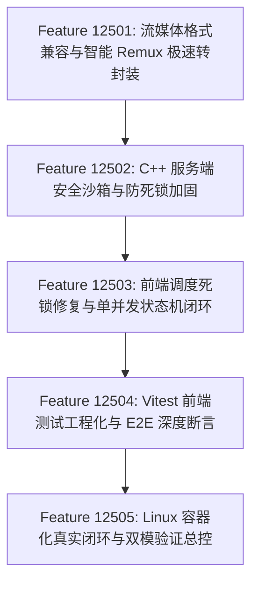

# Feature 12501–12505: Phase 12 核心缺陷修复与端到端闭环计划

> **建立日期**：2026-08-16  
> **所属 Phase**：Phase 12 (Cross-Platform Web UI & Native Server)  
> **背景**：在对 Phase 12 进行严格质量审计与实机体验中，发现了包括视频播放器 `Format error`、C++ 服务端安全漏洞 (LFI)、并发 UAF 与 Worker 死锁、前端调度死锁与取消竞态、前端测试脱节与容器化未闭环等一系列核心缺陷。本计划定义 5 个正交且高度聚焦的修复 Feature（12501–12505），确保 Phase 12 达到工业级安全与可用标准。

---

## 修复 Feature 列表与依赖拓扑

---

### Feature 12501：流媒体格式兼容与智能 Remux 极速转封装 (Media Streaming & Remux Fallback)

- **目标**：彻底解决浏览器 HTML5 `<video>` 播放非原生容器（MKV, AVI, ProRes MOV）时报 `Video Error: MEDIA_ELEMENT_ERROR: Format error` 的问题，实现任意视频格式的秒级播放与自由 Scrubbing。
- **模块清单**：
  - `cpp/include/sublift/adapters/ffmpeg.hpp` & `cpp/src/adapters/ffmpeg/ffmpeg_extractor.cpp`：新增 `remux_to_faststart_mp4` 辅助函数（`-c:v copy -c:a aac -movflags +faststart` 0.3s 极速封装与本地缓存管理）；
  - `cpp/src/server/routes.cpp`：`/api/video/stream` 接入智能容器探针与 Faststart MP4 转封装代理；
  - `apps/web/src/composables/useVideoPlayer.ts` & `VideoPlayer.vue`：切源状态重置、格式诊断与友好错误提示；
  - `apps/web/src/components/DropZone.vue`：修正文案说明。
- **验收标准**：
  - 拖入 MKV、AVI 或标准 MP4 视频，播放器能够秒级正常起播，无 `Format error` 报错；
  - 10Hz 时钟同步、进度条 Seek 与 Canvas ROI 标注在转封装视频上表现完全正常；
  - Catch2 单元测试与 E2E 覆盖转封装与分片流逻辑。

---

### Feature 12502：C++ 服务端安全沙箱、并发 UAF 消除与僵尸 Job 防御 (Server Security & Safety)

- **目标**：彻底封堵 LFI 任意文件读取漏洞，收敛 CORS 策略，消除 Worker 线程死锁与并发崩溃。
- **模块清单**：
  - `cpp/include/sublift/server/path_sandbox.hpp` [NEW]：路径 Canonical 规范化、视频扩展名白名单与目录沙箱校验；
  - `cpp/src/server/http_server.cpp`：收敛 CORS Origin 策略；
  - `cpp/src/server/job_manager.cpp` & `cpp/src/application/bridge.cpp`：调整析构与 Map 擦除顺序，安全 `std::move(worker_thread_)` Join，处理 `handle()` 同步返回的 `DoneMsg`/`ErrorMsg`；
  - `cpp/src/server/routes.cpp`：路由层前置校验 OCR 引擎；补齐 SSE `id:` 协议头与 `progress` 的 `fps` 字段。
- **验收标准**：
  - 请求 `GET /api/video/stream?path=/etc/passwd` 或非媒体文件，严格返回 400/404 Access Denied；
  - 传入非法 `engine` 参数时，路由层返回 400，后台 Worker 线程保持可用且无死锁；
  - Catch2 包含沙箱防御、并发取消无 UAF、同步错误捕获的完整断言。

---

### Feature 12503：前端批量调度器死锁修复、单并发竞态加固与工作台状态闭环 (Frontend Concurrency & State Machine)

- **目标**：彻底消除批量队列死锁与任务被误杀 Bug，完善状态机与交互保护。
- **模块清单**：
  - `apps/web/src/stores/batch.ts`：消除 `finally` 解锁前的重入调度，重构 `cancelTask` 同步状态解耦；
  - `apps/web/src/api/client.ts`：`done` 事件 JSON 解析防御、监听 `cancelled` 事件、保留轻微抖动的原生重连；
  - `apps/web/src/stores/workbench.ts`：引入 `Failed` / `Cancelled` 显式终态与错误信息展示；
  - `apps/web/src/components/LiveTranscript.vue`：在 `Processing` 期间锁定字幕表格行内编辑与打轴操作；
  - `apps/web/src/components/DropZone.vue`：增强纯 Web 沙盒下本地绝对路径录入指引。
- **验收标准**：
  - 批量队列中任一任务失败时，调度器能够自动平滑流转到下一个排队任务，队列不卡死；
  - 快速并发触发取消与完成时，严格保持单任务运行不变量，无任务状态僵死；
  - 流式提取过程中，字幕表格行内编辑处于只读锁定保护。

---

### Feature 12504：前端测试工程化接入 (Vitest) 与 E2E 深度断言加固 (Testing & Verification Pipeline)

- **目标**：消灭假绿与脱节测试资产，建立 100% 真实执行的测试防护网。
- **模块清单**：
  - `apps/web/package.json` & `vite.config.ts`：引入 `vitest` 与 `happy-dom`，配置 `npm test`；
  - `apps/web/src/**/*.test.ts`：标准化迁移为 Vitest 规范测试集；
  - `scripts/test_server_e2e.py`：重构 `TC-JOB-04` 为严格 SRT Exact Match 内容比对；新增单并发排队与自动流转（`TC-QUE-01~03`）及安全沙箱防御（`TC-SEC-01~04`）；
  - `scripts/verify-standard.sh`：完整挂载前端单元测试与 Server E2E 测试。
- **验收标准**：
  - `npm --prefix apps/web test` 零报错，毫秒级通过全部前端测试；
  - `test_server_e2e.py` 严格校验 SRT 序号自增、标准时间轴正则与文本内容，排队流转与安全测试 100% 通过；
  - `./scripts/verify-standard.sh` 包含前端测试与 Server E2E 阶段且全部全绿。

---

### Feature 12505：Linux 容器化真实闭环、双模验证与台账规范化 (Containerization & Dual-Mode Verification)

- **目标**：真正交付 Linux PaddleOCR 容器能力，如实记录台账证据。
- **模块清单**：
  - `Dockerfile`：多阶段多架构拉取 Linux ONNX Runtime、预热下载 PP-OCRv6 模型、开启 `-DSUBLIFT_ENABLE_PADDLE=ON` 并配置 non-root 用户；
  - `docker-compose.yml`：配置模型卷挂载与环境变量；
  - `scripts/verify-web-server.sh`：升级为 Docker 真实构建验收 / 本地优雅降级双模套件；
  - `docs/phases/phase12.json`、`phases.json` & `progress.md`：如实纠正 12401 状态与证据。
- **验收标准**：
  - 在具备 Docker 的环境中，脚本自动执行镜像构建、启动容器并在容器内使用 Paddle 真实提取视频，SRT 比对一致；
  - 在无 Docker 环境下，显式标明容器阶段 `SKIPPED` 并优雅降级为本地契约测试，绝不伪造虚假通过；
  - `phase12.json` 与 `progress.md` 台账与实际交付物完全吻合。
